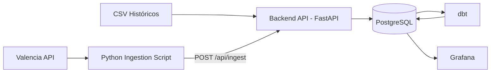
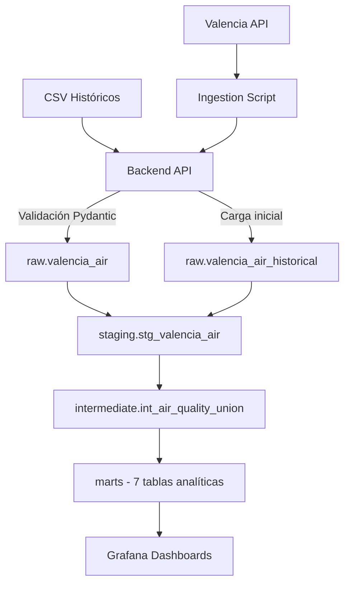
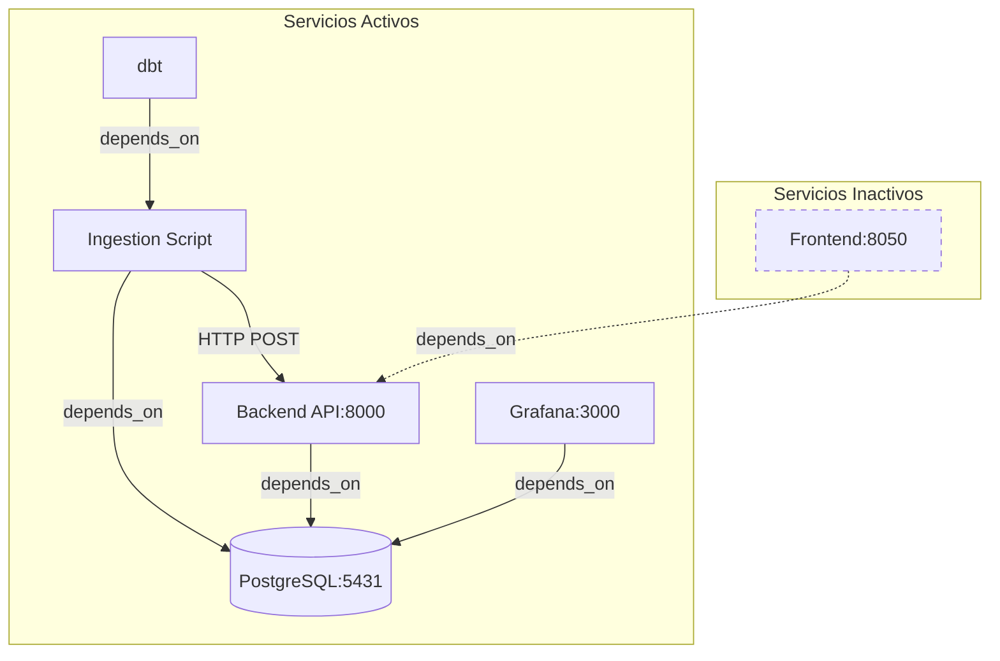

# DOCUMENTACIÓN TÉCNICA DEL PROYECTO

## Pipeline de Datos de Calidad del Aire

---

## RESUMEN EJECUTIVO

**Última actualización**: 22 de enero de 2026

### Arquitectura Actual

El proyecto implementa un pipeline de datos de calidad del aire **completo y operativo** con arquitectura Medallion:

```
API Valencia → Script Python → Backend FastAPI → PostgreSQL → dbt → Grafana
     ↑                              ↑
Datos Históricos (CSV)        Carga automática al inicio
```

### Servicios Activos

| Servicio | Estado | Puerto | Descripción |
|----------|--------|--------|-------------|
| PostgreSQL | ✅ Activo | 5431 | Base de datos principal |
| Backend API | ✅ Activo | 8000 | API de validación e ingesta (FastAPI) + carga histórica |
| Ingestion Script | ✅ Activo | - | Script de extracción (ejecuta cada 5 minutos) |
| dbt | ✅ Activo | - | Transformaciones SQL (ejecuta cada 5 minutos) |
| Grafana | ✅ Activo | 3000 | Visualización y dashboards |
| Frontend | ❌ Inactivo | 8050 | Dashboard Dash (comentado) |

### Tecnologías Principales

- **Contenedores**: Docker Compose
- **Backend**: FastAPI + Pydantic + SQLAlchemy + pandas
- **Base de datos**: PostgreSQL 17-alpine
- **Ingesta**: Python 3.11-slim + requests
- **Transformación**: dbt 1.8.2 (arquitectura Medallion)
- **Visualización**: Grafana (dashboards en tiempo real)
- **Validación**: Pydantic (tipado fuerte, validación automática)

### Comandos Rápidos

```bash
# Iniciar sistema
docker-compose up -d

# Ver estado
docker-compose ps

# Ver logs
docker-compose logs -f backend
docker-compose logs ingestion

# Conectar a BD
psql -h localhost -p 5431 -U postgres -d air_quality_db

# Detener sistema
docker-compose down

# Reset completo (BORRA DATOS)
docker-compose down -v
```

### Accesos Principales

- **Swagger UI (API Docs)**: http://localhost:8000/docs
- **Grafana Dashboards**: http://localhost:3000 (admin/admin)
- **PostgreSQL**: localhost:5431
- **Backend API Endpoint**: http://localhost:8000/api/ingest

### Datos Almacenados

- **Tablas Raw**:
  - `raw.valencia_air` - Datos en tiempo real de la API
  - `raw.valencia_air_historical` - Datos históricos desde CSV
- **Tablas Marts** (analíticas):
  - `marts.fct_air_quality_hourly` - Agregaciones por hora
  - `marts.fct_air_quality_daily` - Agregaciones diarias
  - `marts.fct_calidad_aire_semanal` - Agregaciones semanales
  - `marts.fct_alertas_de_contaminacion` - Alertas por exceso de umbrales OMS
  - `marts.fct_ranking_estaciones` - Ranking de estaciones
  - `marts.dim_estaciones` - Dimensión de estaciones
- **Contaminantes**: NO2, PM10, PM2.5, O3, CO, SO2
- **Frecuencia**: Ingesta automática cada 5 minutos
- **Fuente**: OpenDataSoft Valencia (20 estaciones) + datos históricos CSV

---

## 1. INTRODUCCIÓN

Este documento describe la arquitectura y funcionamiento de un pipeline de datos diseñado para recopilar, validar y almacenar información sobre la calidad del aire en diversas ciudades españolas. El proyecto implementa una **arquitectura de API de barrera** utilizando tecnologías open-source modernas como Docker, FastAPI, PostgreSQL y Pydantic.

### 1.1 Estado Actual del Proyecto

**Arquitectura activa**:
- ✅ **Extracción**: Script Python obtiene datos de la API de Valencia (OpenDataSoft) cada 5 minutos
- ✅ **Carga histórica**: Backend carga automáticamente datos históricos desde CSV al iniciar
- ✅ **Validación**: Backend FastAPI valida cada campo con Pydantic
- ✅ **Persistencia**: Datos estructurados en PostgreSQL (`raw.valencia_air` y `raw.valencia_air_historical`)
- ✅ **Transformación**: dbt ejecuta transformaciones cada 5 minutos (arquitectura Medallion completa)
- ✅ **Visualización**: Grafana activo con dashboards conectados a tablas marts

**Flujo de datos actual**:
```
API Valencia ─────┬───→ Backend FastAPI → PostgreSQL (raw) → dbt → PostgreSQL (marts) → Grafana
                  │
Datos CSV ────────┘ (carga automática al inicio)
```

**Características principales**:
- **Validación automática** de tipos y campos con Pydantic
- **Seguridad en capas** con API de barrera (no acceso directo a BD)
- **Almacenamiento estructurado** con columnas tipadas
- **Arquitectura Medallion** completa: raw → staging → intermediate → marts
- **Alertas automáticas** por exceso de umbrales OMS
- **Datos históricos** cargados automáticamente desde archivos CSV
- **Escalabilidad** horizontal del Backend y script de ingesta
- **Documentación automática** con Swagger UI (http://localhost:8000/docs)

Este pipeline automatiza el proceso completo de extracción, validación, transformación y visualización de datos de calidad del aire en tiempo real.

---

## 2. ARQUITECTURA GENERAL DEL SISTEMA

El sistema sigue un flujo de datos secuencial que comienza con la extracción de información desde APIs públicas y procesa los datos a través de múltiples capas de transformación:

```
APIs Públicas ──┬──→ Script Ingesta Python → Backend API (FastAPI) → PostgreSQL → dbt → Grafana
                │
Datos CSV ──────┘ (carga histórica automática)
```

**Arquitectura actual**: El sistema implementa una **API de barrera (Barrier API)** con FastAPI que actúa como capa de protección entre el script de ingesta y la base de datos. Esto proporciona:
- **Validación de datos**: Pydantic valida cada campo antes de la inserción
- **Seguridad**: Aislamiento del acceso directo a la base de datos
- **Escalabilidad**: Múltiples clientes pueden usar la API sin acceso directo a PostgreSQL
- **Trazabilidad**: Logs centralizados de todas las operaciones
- **Carga histórica**: Datos CSV se cargan automáticamente al iniciar el backend

La base de datos implementa el **patrón Medallion** completo con cuatro capas activas:

- **Raw**: Almacenamiento de datos crudos (`raw.valencia_air` y `raw.valencia_air_historical`)
- **Staging**: Vistas SQL de limpieza y estandarización (`staging.stg_valencia_air`)
- **Intermediate**: Unificación de fuentes (`intermediate.int_air_quality_union`)
- **Marts**: Tablas analíticas agregadas (7 tablas de hechos y dimensiones)

### 2.1 Diagramas de Arquitectura

#### 2.1.1 Arquitectura General del Sistema



#### 2.1.2 Flujo de Datos Actual



#### 2.1.3 Interacción de Servicios Docker



**Leyenda**:
- Líneas sólidas (→): Servicios activos y sus dependencias
- Líneas punteadas (-.->): Servicios deshabilitados
- **Servicios activos**: db, backend, ingestion, dbt, grafana
- **Servicios inactivos**: frontend

---

## 3. COMPONENTES DEL SISTEMA

### 3.1 Base de Datos PostgreSQL

**Ubicación en docker-compose**: Servicio `db` (líneas 2-8)

La base de datos PostgreSQL actúa como repositorio central de información para todo el pipeline. Se utiliza la versión 17-alpine, que es una distribución ligera basada en Alpine Linux que reduce el tamaño de la imagen Docker manteniendo toda la funcionalidad necesaria.

**Configuración del servicio**:
- Imagen: postgres:17-alpine
- Puerto expuesto: 5431 (puerto del host que mapea al puerto interno 5432 del contenedor)
- Base de datos: air_quality_db
- Usuario: postgres
- Contraseña: postgres (definida en archivo .env)
- Política de reinicio: unless-stopped (se reinicia automáticamente excepto si se detiene manualmente)

**Razón del puerto 5431**: Se utiliza un puerto diferente al estándar (5432) para evitar conflictos si el desarrollador tiene otra instancia de PostgreSQL corriendo localmente en su máquina.

**Estructura de esquemas**:

La base de datos implementa la arquitectura Medallion completa con cuatro esquemas activos:

1. **raw** (ACTIVO): Contiene dos tablas principales:

   **Tabla `valencia_air`** (datos en tiempo real):
   - `id`: Clave primaria autoincrementable (SERIAL)
   - `ingested_at`: Timestamp de cuándo se insertó el registro (TIMESTAMPTZ, automático)
   - `objectid`: ID único de la estación (INTEGER)
   - `nombre`: Nombre de la estación (VARCHAR 255)
   - `direccion`: Dirección física de la estación (TEXT)
   - `tipozona`: Tipo de zona (urbana, suburbana, etc.) (VARCHAR 100)
   - `parametros`: Parámetros medidos (TEXT)
   - `mediciones`: Información sobre mediciones (TEXT)
   - Contaminantes: `so2`, `no2`, `o3`, `co`, `pm10`, `pm25` (NUMERIC - permiten nulos)
   - `tipoemisio`: Tipo de emisión (VARCHAR 100)
   - `fecha_carg`: Fecha/hora de la medición (TIMESTAMPTZ)
   - `calidad_am`: Estado de calidad del aire (VARCHAR 100)
   - `fiwareid`: Identificador FIWARE (VARCHAR 255)
   - `geo_shape`: Geometría de la estación (JSONB)
   - `geo_point_2d`: Coordenadas punto 2D (JSONB)

   **Tabla `valencia_air_historical`** (datos históricos desde CSV):
   - `id`: Clave primaria autoincrementable (SERIAL)
   - `ingested_at`: Timestamp de ingesta (TIMESTAMPTZ, automático)
   - `nombre`: Nombre de la estación (TEXT)
   - `fecha_carg`: Fecha/hora de la medición (TIMESTAMPTZ)
   - Contaminantes: `pm25`, `pm10`, `so2`, `co`, `no2`, `o3` (NUMERIC)

2. **staging** (ACTIVO): Contiene vistas/tablas de limpieza:
   - `stg_valencia_air`: Vista que estandariza y limpia datos de ambas tablas raw

3. **intermediate** (ACTIVO): Contiene tablas de unificación:
   - `int_air_quality_union`: Unifica datos de múltiples ciudades en estructura común

4. **marts** (ACTIVO): Contiene tablas analíticas agregadas:
   - `fct_air_quality_hourly`: Promedios por hora y estación
   - `fct_air_quality_daily`: Promedios diarios y picos máximos
   - `fct_calidad_aire_semanal`: Agregaciones semanales
   - `fct_alertas_de_contaminacion`: Registros que exceden umbrales OMS con severidad
   - `fct_calidad_del_aire_detallado`: Rankings y análisis detallado
   - `fct_ranking_estaciones`: Ranking de estaciones por contaminación
   - `dim_estaciones`: Dimensión con metadatos de estaciones

---

### 3.2 Script de Ingestión (Python)

**Ubicación**: Directorio `ingestion/`
**Configuración en docker-compose**: Servicio `ingestion` (líneas 10-20)

El script de ingestión es el primer componente del pipeline. Su responsabilidad es:
1. Extraer datos desde las APIs públicas gubernamentales
2. Enviar los datos a la API de barrera (Backend) mediante HTTP POST
3. El Backend valida los datos y los inserta en PostgreSQL

Está construido en Python 3.11 (imagen slim) y organizado en módulos especializados siguiendo el principio de separación de responsabilidades.

**Modelo de ejecución**: El script ejecuta en un **bucle infinito cada 5 minutos**:
```bash
while true; do
  python main.py;
  echo 'Ingesta completada. Esperando 5 minutos...';
  sleep 300;
done
```
Esto asegura que los datos se actualicen continuamente sin intervención manual.

**Tecnologías utilizadas**:
- `requests`: Para realizar peticiones HTTP a las APIs públicas y al Backend
- `python:3.11-slim`: Imagen base ligera de Docker

#### 3.2.1 Módulo config.py

Este archivo centraliza toda la configuración del sistema en un único punto, lo que facilita el mantenimiento y la migración entre entornos (desarrollo, staging, producción).

**Responsabilidades principales**:
- Lectura de variables de entorno desde el archivo `.env` usando `os.getenv()`
- Definición del diccionario `CITIES_CONFIG` que actúa como registro de ciudades disponibles
- Configuración de URL de la API de barrera (Backend)
- Parámetros globales de ingesta (reintentos, timeouts)

**Estructura del diccionario CITIES_CONFIG**:

Cada ciudad tiene tres propiedades obligatorias:
- `api_url`: URL completa de la API pública de la ciudad
- `table_name`: Nombre de referencia de la tabla (usado para logging)
- `active`: Booleano que controla si la ciudad se procesa en esta ejecución

**Variables importantes**:
- `BARRIER_API_URL`: URL del endpoint de ingesta del backend (ejemplo: `http://backend:8000/api/ingest`)
- `RETRY_ATTEMPTS`: Número de reintentos para llamadas HTTP (3)
- `TIMEOUT_SECONDS`: Timeout para peticiones HTTP (10 segundos)

**Estado actual de ciudades**:
- **Valencia**: Activa (`active: True`) - Se está ingiriendo datos actualmente
  - API: OpenDataSoft Valencia (API v2.1)
  - Límite: 20 registros por petición
- **Madrid**: Inactiva (`active: False`) - Estructura definida, pendiente de implementación
  - API: datos.madrid.es
- **País Vasco**: Inactiva (`active: False`) - Estructura definida, pendiente de implementación
  - API: opendata.euskadi.eus

Esta arquitectura permite activar o desactivar ciudades cambiando un solo valor, sin necesidad de modificar código.

#### 3.2.2 Módulo utils.py

Contiene funciones auxiliares reutilizables que se usan en múltiples partes del proyecto.

**Función f_llamada_api(api_url, api_nombre)**:

Esta función encapsula la lógica de llamadas HTTP con manejo robusto de errores.

- Realiza peticiones HTTP GET a las APIs públicas
- Usa los parámetros globales `RETRY_ATTEMPTS` y `TIMEOUT_SECONDS` definidos en config.py
- Implementa reintentos automáticos con pausas de 2 segundos entre intentos
- Esto hace el sistema resiliente ante caídas temporales de las APIs externas o problemas de red
- Captura excepciones de tipo `requests.exceptions.RequestException` que incluyen timeouts, errores de conexión, etc.
- Registra cada intento fallido en consola para facilitar el debugging
- Retorna el objeto `response` de la librería requests, que contiene status code, headers y contenido
- Lanza `RuntimeError` si todos los intentos fallan

Esta función es crítica porque las APIs externas pueden tener intermitencias, especialmente las gubernamentales que no están diseñadas para alta disponibilidad.


#### 3.2.3 Módulo main.py (Orquestador)

Este es el punto de entrada principal del script. Contiene la función `orquestador()` que coordina todo el proceso de ingestión de forma secuencial y controlada.

**Diccionario INGESTION_MAP**:

Mapea nombres de ciudades con sus funciones específicas de ingestión. Este patrón de diseño permite añadir nuevas ciudades simplemente registrando su función aquí:
```python
INGESTION_MAP = {
    "valencia": f_run_ingestion_valencia,
    # "madrid": f_run_ingestion_madrid,  # Comentada, pendiente de activar
}
```

**Flujo de ejecución detallado**:

1. **Espera inicial (5 segundos)**:
   - Pausa deliberada para asegurar que PostgreSQL y el Backend han arrancado completamente en Docker
   - En Docker Compose, aunque `depends_on` establece orden de inicio, no garantiza que los servicios estén listos para aceptar conexiones
   - Esta espera evita errores de conexión en el primer intento

2. **Iteración sobre ciudades configuradas**:
   - Recorre el diccionario `CITIES_CONFIG` obtenido desde config.py
   - Para cada ciudad, verifica la propiedad `active`
   - Solo procesa ciudades con `active: True`, saltando las demás
   - Imprime en consola qué ciudad está procesando

3. **Resolución de función mediante mapeo**:
   - Busca la función correspondiente en `INGESTION_MAP` usando el nombre de la ciudad como clave
   - Si no encuentra la función, registra un error pero continúa con la siguiente ciudad
   - Este diseño permite tener ciudades configuradas aunque aún no tengan implementación

4. **Ejecución de ingesta específica**:
   - Ejecuta la función de ingesta pasando dos parámetros:
     - `api_url`: URL de la API pública de la ciudad
     - `BARRIER_API_URL`: URL del endpoint de ingesta del Backend
   - La función se ejecuta dentro de un bloque try-except

5. **Manejo de errores resiliente**:
   - Si una ciudad falla, captura la excepción, registra el error en logs pero continúa con las siguientes
   - Esto evita que un problema en una ciudad detenga la ingesta de las demás
   - Implementa el principio de "fail gracefully"

6. **Finalización**:
   - Imprime mensaje de finalización del proceso
   - El contenedor termina con código de salida 0 si todo fue exitoso

#### 3.2.4 Módulo ciudades/valencia.py

Implementa la lógica específica para extraer datos de la API de Valencia y enviarlos al Backend.

**Ubicación**: `ingestion/ciudades/valencia.py`

**Formato de la API de Valencia**: La API retorna JSON con la siguiente estructura:
```json
{
  "results": [
    {
      "objectid": 123,
      "nombre": "Nombre de la estación",
      "direccion": "Calle ejemplo",
      "no2": 25.5,
      "pm10": 30.2,
      "pm25": 15.3,
      "fecha_carg": "2024-01-19T10:30:00Z",
      "geo_shape": {...},
      "geo_point_2d": {...},
      ...otros campos...
    }
  ]
}
```

**Proceso de ingesta paso a paso**:

1. **Llamada a la API pública**:
   - Usa `f_llamada_api()` para obtener datos de Valencia
   - URL: OpenDataSoft Valencia API v2.1
   - Límite: 20 registros por petición

2. **Parsing de respuesta**:
   - Convierte la respuesta HTTP a diccionario Python con `.json()`
   - Extrae el array de estaciones desde `data.get('results', [])`

3. **Validación básica**:
   - Verifica que el array no esté vacío
   - Si está vacío, registra advertencia y termina

4. **Envío al Backend (API de Barrera)**:
   - Realiza POST a `barrier_api_url` (ejemplo: `http://backend:8000/api/ingest`)
   - Envía la lista completa de estaciones como JSON
   - El Backend con FastAPI valida automáticamente con Pydantic

5. **Verificación del resultado**:
   - Si el status code es 201: Éxito, imprime mensaje de confirmación
   - Si es otro código: Error, imprime el status y el mensaje de error del Backend

6. **Manejo de errores**:
   - Captura cualquier excepción durante el proceso
   - Registra el error y re-lanza la excepción para que el orquestador la maneje

**Aspectos técnicos importantes**:
- **Desacoplamiento**: El script de ingesta NO conecta directamente a PostgreSQL
- **Validación remota**: Toda la validación de datos ocurre en el Backend con Pydantic
- **Simplicidad**: La función solo hace GET a la API pública y POST al Backend
- **Resiliencia**: Los errores de red se manejan con reintentos en `f_llamada_api()`

### 3.3 Backend API de Barrera (FastAPI)

**Ubicación**: Directorio `backend/`
**Configuración en docker-compose**: Servicio `backend` (líneas 54-62)

El Backend API es una **API de barrera** construida con FastAPI que actúa como capa de protección entre el script de ingesta y la base de datos PostgreSQL. Es el componente central de la arquitectura actual del proyecto.

**Propósito y ventajas**:

1. **Seguridad**: Aislamiento del acceso directo a la base de datos
2. **Validación**: Pydantic valida automáticamente cada campo antes de la inserción
3. **Trazabilidad**: Logs centralizados de todas las operaciones de ingesta
4. **Escalabilidad**: Múltiples clientes pueden enviar datos sin credenciales de BD
5. **Mantenibilidad**: Cambios en el esquema de BD solo requieren actualizar el Backend
6. **Documentación automática**: Swagger UI generado automáticamente por FastAPI

**Configuración del servicio**:
- Framework: FastAPI (Python)
- Puerto expuesto: 8000
- Acceso: http://localhost:8000/docs (Swagger UI)
- Base de datos: Conexión a PostgreSQL mediante SQLAlchemy
- Política de reinicio: unless-stopped

#### 3.3.1 Arquitectura del Backend

**Módulo config.py**:
- Configura el `engine` de SQLAlchemy para conectar a PostgreSQL
- Lee variables de entorno desde `.env`
- Construye la URL de conexión: `postgresql://{user}:{password}@{host}:{port}/{database}`

**Módulo database.py**:

Contiene las funciones de inicialización de base de datos y carga de datos históricos:

**Función `init_db()`** - Inicializa la infraestructura:

1. **Lógica de reintentos (10 intentos)**:
   - Crucial en Docker donde PostgreSQL puede tardar en estar listo
   - Pausa de 2 segundos entre intentos

2. **Creación de esquemas**:
   - `CREATE SCHEMA IF NOT EXISTS raw;`
   - `CREATE SCHEMA IF NOT EXISTS staging;`
   - `CREATE SCHEMA IF NOT EXISTS intermediate;`
   - `CREATE SCHEMA IF NOT EXISTS marts;`

3. **Creación de tablas raw**:
   - `raw.valencia_air`: Datos en tiempo real (19 columnas estructuradas)
   - `raw.valencia_air_historical`: Datos históricos desde CSV

4. **Idempotencia**:
   - Usa `IF NOT EXISTS` en todas las operaciones
   - Se puede ejecutar múltiples veces sin errores

**Función `load_historical_data()`** - Carga datos históricos:

1. **Verificación**: Solo carga si la tabla `valencia_air_historical` está vacía
2. **Lectura de CSV**: Lee archivos del directorio `/app/historical/`
3. **Formato de archivos**:
   - Separador: punto y coma (`;`)
   - Encoding: `latin-1`
   - Columnas: Fecha, PM2.5, PM10, SO2, CO, NO2, O3
4. **Mapeo de estaciones**: Extrae nombre de estación del nombre del archivo
5. **Conversión de fechas**: Formato `%d/%m/%Y %H:%M` a TIMESTAMPTZ
6. **Inserción masiva**: Usa pandas `to_sql()` para inserción eficiente

**Módulo main.py (API)**:

Define la API FastAPI con endpoints y modelos de validación.

#### 3.3.2 Modelo de Datos Pydantic

**Clase AirQualityInbound**:

Modelo Pydantic que define exactamente qué campos se esperan del JSON de Valencia:

```python
class AirQualityInbound(BaseModel):
    # Identificadores (Obligatorios)
    objectid: int
    fiwareid: str
    nombre: str
    direccion: str

    # Contexto de la zona
    tipozona: str
    tipoemisio: str
    calidad_am: str
    fecha_carg: str

    # Parámetros descriptivos (Opcionales)
    parametros: Optional[str] = None
    mediciones: Optional[str] = None

    # Contaminantes (Opcionales)
    so2: Optional[float] = None
    no2: Optional[float] = None
    o3: Optional[float] = None
    co: Optional[float] = None
    pm10: Optional[float] = None
    pm25: Optional[float] = None

    # Geografía (Diccionarios genéricos)
    geo_shape: Dict[str, Any]
    geo_point_2d: Dict[str, Any]

    # Configuración de seguridad
    model_config = ConfigDict(extra='forbid')
```

**Características de seguridad**:
- `extra='forbid'`: Rechaza cualquier campo no declarado en el modelo
- Previene inyección de campos maliciosos
- Garantiza que solo se procesen datos esperados

**Tipos de datos**:
- Obligatorios: Sin `Optional`, causan error 422 si faltan
- Opcionales: Con `Optional[tipo] = None`, permiten valores nulos
- Tipado fuerte: FastAPI valida tipos automáticamente

#### 3.3.3 Endpoint de Ingesta

**POST /api/ingest**

Endpoint principal que recibe datos del script de ingesta.

**Flujo de procesamiento**:

1. **Recepción y validación automática**:
   ```python
   @app.post("/api/ingest", status_code=201)
   async def ingest_air_data(data: list[AirQualityInbound]):
   ```
   - Recibe lista de objetos `AirQualityInbound`
   - Pydantic valida cada objeto automáticamente
   - Si falla validación, retorna HTTP 422 con detalles del error

2. **Conversión a DataFrame**:
   ```python
   payload = [item.model_dump() for item in data]
   df = pd.DataFrame(payload)
   ```
   - Convierte modelos Pydantic a diccionarios
   - Crea DataFrame de pandas para inserción eficiente

3. **Inserción en PostgreSQL**:
   ```python
   df.to_sql(
       'valencia_air',
       engine,
       schema='raw',
       if_exists='append',
       index=False,
       dtype={
           'geo_shape': types.JSON,
           'geo_point_2d': types.JSON,
           'fecha_carg': types.DateTime(timezone=True)
       }
   )
   ```
   - Usa SQLAlchemy para inserción masiva
   - `if_exists='append'`: Añade registros sin borrar existentes
   - Tipado explícito para JSONB y TIMESTAMPTZ

4. **Respuesta exitosa**:
   ```json
   {
     "status": "success",
     "message": "Se han insertado 20 registros en columnas independientes."
   }
   ```

5. **Manejo de errores**:
   - Captura cualquier excepción durante la inserción
   - Retorna HTTP 500 con mensaje de error
   - Registra error en logs del contenedor

#### 3.3.4 Ciclo de Vida de la API

**Función lifespan**:

FastAPI ejecuta código al arrancar y apagar el contenedor:

```python
@asynccontextmanager
async def lifespan(app: FastAPI):
    # --- AL ARRANCAR ---
    try:
        init_db()  # Crea esquemas y tablas
    except Exception as e:
        print(f"❌ Error inicializando BD: {e}")

    yield  # Pausa: la API está corriendo

    # --- AL APAGAR ---
    # (Aquí se pueden cerrar conexiones, etc.)
```

**Ventajas**:
- Garantiza que la BD esté lista antes de aceptar peticiones
- Manejo centralizado de inicialización
- Logs claros de errores de arranque

#### 3.3.5 Documentación Automática

FastAPI genera documentación interactiva automáticamente:

**Swagger UI**: http://localhost:8000/docs
- Interfaz visual para probar endpoints
- Muestra modelos de datos, parámetros, respuestas
- Permite ejecutar peticiones de prueba

**ReDoc**: http://localhost:8000/redoc (endpoint comentado actualmente)
- Documentación alternativa más limpia
- Ideal para compartir con usuarios finales

**Metadatos de la API**:
```python
app = FastAPI(
    lifespan=lifespan,
    title="Air Quality Barrier API",
    description="API de aislamiento para proteger el acceso a air_quality_db",
    version="1.0.0"
)
```

#### 3.3.6 Ventajas de la Arquitectura de Barrera

1. **Seguridad en capas**:
   - El script de ingesta NO tiene credenciales de PostgreSQL
   - Si el script se compromete, no hay acceso directo a la BD

2. **Validación centralizada**:
   - Un solo punto de validación para todos los clientes
   - Cambios en validación no requieren actualizar scripts

3. **Trazabilidad completa**:
   - Todos los logs de ingesta están en el contenedor backend
   - Fácil auditoría de qué datos entraron y cuándo

4. **Escalabilidad horizontal**:
   - Múltiples instancias del script pueden enviar datos
   - El Backend puede escalar independientemente

5. **Preparado para el futuro**:
   - Fácil añadir autenticación (JWT, API keys)
   - Fácil añadir rate limiting
   - Fácil exponer endpoints de consulta (actualmente comentados)

---

### 3.4 Transformaciones con dbt (ACTIVO)

**Ubicación**: Directorio `dbt/air_quality_dbt/`
**Configuración en docker-compose**: Servicio `dbt`

✅ **ESTADO ACTUAL**: El servicio dbt está **activo y funcionando**, ejecutando transformaciones cada 5 minutos.

dbt (data build tool) es una herramienta moderna de transformación de datos que permite escribir transformaciones SQL modulares y testeables. En este proyecto, dbt toma los datos de la capa raw y los transforma progresivamente hasta crear tablas analíticas.

**Modelos implementados**:

**Staging**:
- `stg_valencia_air`: Limpia y estandariza datos de `raw.valencia_air` y `raw.valencia_air_historical`

**Intermediate**:
- `int_air_quality_union`: Unifica datos de múltiples ciudades en estructura común

**Marts** (7 tablas analíticas):
- `fct_air_quality_hourly`: Promedios por hora
- `fct_air_quality_daily`: Promedios diarios con picos máximos
- `fct_calidad_aire_semanal`: Agregaciones semanales
- `fct_alertas_de_contaminacion`: Alertas por exceso de umbrales OMS (con severidad: LEVE, MODERADO, GRAVE, CRÍTICO)
- `fct_calidad_del_aire_detallado`: Rankings y análisis detallado
- `fct_ranking_estaciones`: Ranking de estaciones por nivel de contaminación
- `dim_estaciones`: Dimensión con metadatos de estaciones (nombre, dirección, zona, coordenadas)

**Configuración especial en Docker**:

El docker-compose sobrescribe el `entrypoint` de la imagen oficial de dbt con un script shell personalizado:
```bash
sleep 20;
while true; do
  dbt run && dbt docs generate --static;
  echo 'Transformación completada. Esperando 5 minutos...';
  sleep 300;
done
```

**¿Por qué sobrescribir el entrypoint?**
- La imagen oficial de dbt está diseñada para ejecutar un solo comando y terminar
- Nosotros necesitamos un proceso que se ejecute continuamente
- El script implementa un bucle infinito que ejecuta transformaciones cada 5 minutos

**Comportamiento del servicio**:
1. **Espera inicial de 20 segundos**: Da tiempo a que la aplicación Python inserte los primeros datos en raw
2. **Ejecución de transformaciones**: Ejecuta `dbt run` que materializa todos los modelos definidos
3. **Generación de documentación**: Ejecuta `dbt docs generate --static` que crea documentación HTML de todos los modelos
4. **Espera de 5 minutos**: `sleep 300` antes de repetir el ciclo
5. **Bucle infinito**: El `while true` hace que este proceso se repita indefinidamente

#### 3.3.1 Configuración de conexión (profiles.yml)

El archivo `profiles.yml` define cómo dbt se conecta a la base de datos PostgreSQL. Este archivo es fundamental porque dbt necesita saber dónde ejecutar las transformaciones SQL.

**Estructura del perfil**:
```yaml
air_quality_dbt:
  outputs:
    dev:
      type: postgres
      host: db           # Nombre del servicio Docker (no localhost)
      port: 5432         # Puerto interno del contenedor
      user: postgres
      pass: postgres
      dbname: air_quality_db
      schema: public
      threads: 1
  target: dev
```

**Aspectos importantes**:

- **host: db**: Usamos el nombre del servicio Docker, no `localhost`. Dentro de la red de Docker Compose, los servicios se comunican por nombre.
- **port: 5432**: Usamos el puerto interno del contenedor (5432), no el puerto expuesto del host (5431).
- **target: dev**: Indica qué configuración usar por defecto. En proyectos más grandes se tendrían múltiples targets (dev, staging, prod).
- **threads: 1**: Número de consultas SQL que dbt puede ejecutar en paralelo. Con 1 thread, los modelos se ejecutan secuencialmente.
- **schema: public**: Esquema por defecto, aunque los modelos pueden sobrescribir esto (como hacemos con staging, intermediate, marts).

#### 3.3.2 Configuración del proyecto (dbt_project.yml)

El archivo `dbt_project.yml` es el archivo de configuración principal del proyecto dbt. Define cómo se deben materializar y organizar los modelos.

**Configuración de materialización por capa**:

```yaml
models:
  air_quality_dbt:
    staging:
      +materialized: view
      +schema: staging
      +tags: ["staging"]

    intermediate:
      +materialized: table
      +schema: intermediate
      +tags: ["intermediate"]

    marts:
      +materialized: table
      +schema: marts
      +tags: ["marts"]
```

**Explicación de cada capa**:

**Staging**:
- **Materialización: view**: Los modelos staging se crean como vistas SQL, no tablas físicas
- **Ventaja de las vistas**: No duplican datos, solo proporcionan una forma estructurada de acceder a raw
- **Desventaja**: Las consultas son ligeramente más lentas porque se ejecutan cada vez
- **Esquema destino: staging**: dbt creará automáticamente un esquema llamado `staging` y pondrá allí estas vistas
- **Tags**: Permiten ejecutar solo modelos staging con `dbt run --select tag:staging`

**Intermediate**:
- **Materialización: table**: Se crean como tablas físicas en la base de datos
- **Ventaja**: Consultas rápidas porque los datos ya están materializados
- **Desventaja**: Ocupan más espacio en disco
- **Uso**: Esta capa unifica múltiples fuentes y hace transformaciones complejas, por eso se materializa como tabla

**Marts**:
- **Materialización: table**: Tablas físicas optimizadas para consultas de negocio
- **Razón**: Son las tablas que consulta Grafana, deben ser rápidas
- **Contienen**: Métricas agregadas (promedios, máximos, conteos) calculadas con GROUP BY
- **Esquema destino: marts**: Todas las tablas analíticas van al esquema `marts`

#### 3.3.3 Capa Staging

**Archivo**: models/staging/stg_valencia_air.sql

**Propósito**: Extraer y tipificar campos desde el JSONB crudo.

**Proceso**:
1. Lee desde raw.valencia_air usando la función source() de dbt
2. Utiliza jsonb_extract_path_text() para extraer cada campo del JSON
3. Realiza conversión de tipos explícita:
   - TEXT para identificadores y nombres
   - FLOAT para magnitudes de contaminantes
   - TIMESTAMP WITH TIME ZONE para fechas

**Campos extraídos**:
- station_id: Identificador de estación
- station_name: Nombre de la estación
- no2: Dióxido de nitrógeno
- pm10: Material particulado de 10 micras
- pm25: Material particulado de 2.5 micras
- so2: Dióxido de azufre
- o3: Ozono
- co: Monóxido de carbono
- air_quality_status: Estado de calidad del aire
- measure_timestamp: Momento de la medición
- ingested_at: Momento de ingesta en la base de datos

**Archivo**: models/staging/sources.yml

Define las fuentes de datos que dbt puede referenciar:

- Nombre de fuente: air_quality
- Base de datos: air_quality_db
- Esquema: raw
- Tablas:
  - valencia_air (con tests de not_null y unique en station_id)
  - madrid_air (comentada, inactiva)

#### 3.3.4 Capa Intermediate

**Archivo**: models/intermediate/int_air_quality_union.sql

**Propósito**: Unificar datos de múltiples ciudades en una estructura común.

**Estrategia**:

1. **CTE valencia_data**:
   - Selecciona todos los campos desde stg_valencia_air
   - Añade columna literal 'Valencia' como city

2. **CTE madrid_placeholder**:
   - Define la estructura con los mismos campos
   - Usa NULL con tipado explícito para cada columna
   - Incluye WHERE FALSE para que no retorne filas
   - Permite que la estructura esté preparada sin datos reales

3. **Unión final**:
   - Usa UNION ALL para combinar ambas CTEs
   - UNION ALL es más eficiente que UNION porque no elimina duplicados

**Resultado**: Tabla unificada con columna city que permite diferenciar el origen de cada registro.

#### 3.3.5 Capa Marts

**Archivo**: models/marts/fct_air_quality_daily.sql

**Propósito**: Agregar métricas por día para análisis de tendencias históricas.

**Transformaciones aplicadas**:

1. Agrupa por:
   - measure_date (fecha sin hora)
   - city
   - station_id
   - station_name

2. Calcula métricas agregadas:
   - Promedios diarios: AVG(no2), AVG(pm10), AVG(pm25)
   - Redondea a 2 decimales con ROUND()
   - Picos máximos: MAX(no2), MAX(pm10)

3. Filtra registros con timestamp nulo

4. Ordena por fecha descendente y ciudad

**Uso**: Esta tabla es ideal para dashboards que muestren evolución diaria de contaminantes.

**Archivo**: models/marts/fct_air_quality_hourly.sql

Similar a la tabla diaria pero con agregación por hora (no mostrado en el análisis pero mencionado en la estructura).

---

### 3.5 Visualización con Grafana (ACTIVO)

**Configuración en docker-compose**: Servicio `grafana`

✅ **ESTADO ACTUAL**: El servicio Grafana está **activo y funcionando** en el puerto 3000.

**Configuración del servicio**:
- Imagen: grafana/grafana:latest
- Puerto expuesto: 3000
- Usuario administrador: admin
- Contraseña: admin

**Volúmenes montados**:
- `./grafana/provisioning/datasources`: Configuración automática de conexión a PostgreSQL
- `grafana_data`: Volumen persistente para datos de configuración

**Configuración del datasource PostgreSQL** (`grafana/provisioning/datasources/postgres.yaml`):
```yaml
apiVersion: 1
datasources:
  - name: PostgreSQL
    type: postgres
    url: db:5432
    database: air_quality_db
    user: postgres
    secureJsonData:
      password: postgres
    jsonData:
      sslmode: disable
      postgresVersion: 1700
```

**Fuente de datos**:
Grafana conecta directamente al servicio "db" dentro de la red Docker, consultando las tablas del esquema `marts` para obtener datos agregados:
- `marts.fct_air_quality_hourly` - Gráficos de evolución horaria
- `marts.fct_air_quality_daily` - Tendencias diarias
- `marts.fct_alertas_de_contaminacion` - Panel de alertas
- `marts.fct_ranking_estaciones` - Rankings de estaciones
- `marts.dim_estaciones` - Información de estaciones

**Acceso**:
- URL: http://localhost:3000
- Credenciales: admin / admin

---

## 4. FLUJO COMPLETO DE DATOS

El sistema procesa datos siguiendo este flujo secuencial:

**Fase 1: Extracción desde APIs Públicas (Script de Ingesta)**

1. El orquestador (`main.py`) ejecuta al arrancar el contenedor
2. Espera 5 segundos para asegurar que PostgreSQL y Backend estén listos
3. Lee la configuración de ciudades activas desde `config.py`
4. Para cada ciudad activa (actualmente solo Valencia):
   - Llama a la API pública usando `f_llamada_api()`
   - Recibe respuesta JSON con datos de estaciones
   - Extrae el array de estaciones desde `results`

**Fase 2: Validación y Persistencia (Backend API)**

1. El script envía los datos al Backend mediante HTTP POST a `/api/ingest`
2. FastAPI recibe la lista de estaciones como JSON
3. Pydantic valida automáticamente cada objeto con el modelo `AirQualityInbound`:
   - Verifica que los campos obligatorios existan
   - Valida tipos de datos (int, float, str, dict)
   - Rechaza campos no declarados (`extra='forbid'`)
   - Si falla la validación, retorna HTTP 422 con detalles
4. Si la validación es exitosa:
   - Convierte los modelos Pydantic a DataFrame de pandas
   - Inserta en PostgreSQL: `raw.valencia_air`
   - Usa SQLAlchemy para inserción eficiente
   - Maneja tipos especiales (JSONB para geo_shape/geo_point_2d, TIMESTAMPTZ para fecha_carg)
5. El Backend retorna respuesta al script:
   - HTTP 201: Éxito con mensaje de confirmación
   - HTTP 500: Error con detalles del problema

**Fase 3: Almacenamiento Estructurado (PostgreSQL)**

Los datos se almacenan en `raw.valencia_air` con 19 columnas estructuradas:
- Identificadores: objectid, fiwareid, nombre, direccion
- Contaminantes: so2, no2, o3, co, pm10, pm25 (valores numéricos o NULL)
- Metadatos: tipozona, tipoemisio, calidad_am, parametros, mediciones
- Temporal: fecha_carg (timestamp de la medición), ingested_at (timestamp de ingesta automático)
- Geográfico: geo_shape, geo_point_2d (JSONB con coordenadas y geometría)

**Fase 4: Transformación y Análisis (ACTIVA)**

El servicio dbt ejecuta transformaciones cada 5 minutos:
1. **Staging** (`stg_valencia_air`): Limpia y estandariza datos crudos
2. **Intermediate** (`int_air_quality_union`): Unifica datos de múltiples fuentes
3. **Marts**: Genera 7 tablas analíticas:
   - Agregaciones horarias, diarias y semanales
   - Alertas por exceso de umbrales OMS
   - Rankings de estaciones
   - Dimensión de estaciones

**Fase 5: Visualización (ACTIVA)**

**Grafana** (http://localhost:3000):
- Dashboards conectados a tablas marts
- Visualización en tiempo real de métricas
- Alertas visuales de contaminación
- Credenciales: admin / admin

**Métodos adicionales de consulta**:
- psql (línea de comandos)
- Herramientas gráficas (pgAdmin, DBeaver, etc.)
- Ver sección 6.2 para ejemplos de consultas útiles

**Métodos futuros** (deshabilitados):
- Frontend Dashboard: Interfaz web interactiva con Dash/Plotly (código listo en `/frontend`)
- Endpoints de consulta del Backend API: Para aplicaciones externas

---

## 5. INSTRUCCIONES DE DESPLIEGUE

### 5.1 Requisitos previos

Antes de iniciar el proyecto, asegúrate de tener:

- **Docker Desktop** instalado y en ejecución (abrir la aplicación Docker Desktop)
- **Docker Compose** instalado (viene incluido con Docker Desktop en Windows y Mac)
- **Puertos libres**: 3000 (Grafana) y 5431 (PostgreSQL)
  
  - Verificar que no estén ocupados por otros proyectos o servicios
  - En Windows: `netstat -ano | findstr :3000`
  - En Linux/Mac: `lsof -i :3000`

### 5.2 Iniciar el sistema completo

Desde el directorio raíz del proyecto (donde está el archivo `docker-compose.yml`), ejecutar:

```bash
docker-compose up -d
```

**Significado del comando**:
- `docker-compose up`: Inicia todos los servicios definidos en docker-compose.yml


- `-d` (detached): Ejecuta los contenedores en segundo plano, liberando la terminal para seguir trabajando


**Servicios que se inician** (configuración actual):
1. **Base de datos PostgreSQL** (puerto 5431) - Contenedor persistente
2. **Backend API FastAPI** (puerto 8000) - Contenedor persistente que valida e inserta datos + carga histórica
3. **Script de ingestión Python** (ejecuta cada 5 minutos) - Obtiene datos y los envía al Backend
4. **dbt** (transformaciones SQL cada 5 minutos) - Genera tablas analíticas
5. **Grafana** (puerto 3000) - Dashboards de visualización

**Servicios deshabilitados** (comentados en docker-compose.yml):
- Frontend Dashboard (puerto 8050)

Para habilitar el frontend, ver sección 5.7.

**Primera ejecución**: La primera vez puede tardar varios minutos porque Docker debe descargar las imágenes base (postgres, dbt).

### 5.3 Verificar estado de servicios

Para verificar que todos los contenedores están corriendo correctamente:

```bash
docker-compose ps
```

**Salida esperada** (configuración actual):
```
NAME           STATUS          PORTS
db             Up 2 minutes    0.0.0.0:5431->5432/tcp
backend        Up 2 minutes    0.0.0.0:8000->8000/tcp
ingestion      Up 2 minutes
dbt            Up 2 minutes
grafana        Up 2 minutes    0.0.0.0:3000->3000/tcp
```

**Interpretación**:
- `Up`: El contenedor está corriendo activamente
- `Exited (0)`: El contenedor terminó correctamente
- `Exited (1)`: El contenedor terminó con error (revisar logs con `docker-compose logs <servicio>`)

**Nota**: Se listan 5 servicios activos (db, backend, ingestion, dbt, grafana). El frontend está deshabilitado.

### 5.4 Consultar logs

Los logs son fundamentales para diagnosticar problemas y verificar que todo funciona correctamente.

**Ver logs de todos los servicios**:
```bash
docker-compose logs -f
```

**Ver logs de un servicio específico**:
```bash
docker-compose logs -f ingestion  # Ver si la ingesta funcionó
docker-compose logs -f backend    # Ver validación y inserción de datos
docker-compose logs -f db         # Ver consultas SQL y conexiones
```

**Significado del parámetro `-f` (follow)**:
- Muestra los logs en tiempo real a medida que se generan
- Ideal para ver si la ingesta de la API funciona o si hay errores
- Presionar `Ctrl+C` para salir del modo follow


**Ver solo las últimas líneas**:
```bash
docker-compose logs --tail=50 ingestion  # Últimas 50 líneas del script
docker-compose logs --tail=100 backend   # Últimas 100 líneas del backend
```

### 5.5 Reconstruir imágenes tras cambios en código

Si modificas archivos Python (`main.py`, `database.py`, etc.) o el `Dockerfile`, Docker necesita reconstruir la imagen para incluir los cambios:

```bash
docker-compose build      # Reconstruye las imágenes
docker-compose up -d      # Reinicia con las nuevas imágenes
```


**Flujo completo de actualización**:
```bash
# 1. Detener servicios
docker-compose down

# 2. Reconstruir imágenes
docker-compose build

# 3. Iniciar con nuevas imágenes
docker-compose up -d

# 4. Verificar logs
docker-compose logs -f backend
docker-compose logs ingestion
```

### 5.6 Detener el sistema

**Detener sin eliminar datos**:
```bash
docker-compose down
```
Esto detiene y elimina los contenedores, pero mantiene los volúmenes (datos de PostgreSQL y Grafana se conservan).

**Reseteo completo** (eliminar también datos):
```bash
docker-compose down -v
```

**Significado del parámetro `-v` (volumes)**:
- Elimina los volúmenes de Docker donde se guardan datos persistentes
- Se usa cuando quieres empezar desde cero
- **Precaución**: Borra todos los datos de la base de datos y configuraciones de Grafana


### 5.7 Configuración de Servicios Opcionales

El proyecto incluye servicios adicionales que están deshabilitados por defecto. Esta sección explica cómo habilitarlos según tus necesidades.

#### 5.7.1 Grafana (YA HABILITADO)

✅ **Grafana ya está habilitado por defecto** y se inicia automáticamente con `docker-compose up -d`.

**Acceso**:
- URL: http://localhost:3000
- Usuario: admin
- Contraseña: admin

**Configuración**:
El datasource de PostgreSQL está **pre-configurado** en `grafana/provisioning/datasources/postgres.yaml`:
```yaml
apiVersion: 1
datasources:
  - name: PostgreSQL
    type: postgres
    url: db:5432
    database: air_quality_db
    user: postgres
    secureJsonData:
      password: postgres
    jsonData:
      sslmode: disable
      postgresVersion: 1700
```

**Si necesitas reiniciar solo Grafana**:
```bash
docker-compose restart grafana
```

#### 5.7.2 Backend API (YA HABILITADO)

✅ **El Backend ya está habilitado por defecto** y se inicia automáticamente.

**Acceso**:
- Swagger UI: http://localhost:8000/docs
- Endpoint de ingesta: POST http://localhost:8000/api/ingest

**Funcionalidades**:
- Validación de datos con Pydantic
- Carga automática de datos históricos al iniciar
- Inserción en PostgreSQL

#### 5.7.3 Habilitar Frontend Dashboard (DESHABILITADO)

**Requisito**: El backend ya está activo.

**Paso 1**: Descomentar el servicio frontend en docker-compose.yml

**Paso 2**: Iniciar el servicio

```bash
docker-compose up -d frontend
```

**Paso 3**: Acceder al dashboard

- URL: http://localhost:8050

**Funcionalidades del frontend** (cuando está habilitado):
- Gráficos interactivos con Plotly
- Evolución horaria de NO2
- Banner de alertas de calidad del aire
- Actualización automática cada 60 segundos
- Filtrado por estaciones

#### 5.7.4 Iniciar servicios selectivos

Puedes iniciar solo los servicios que necesites:

```bash
# Solo base de datos y app de ingesta
docker-compose up -d db app

# Base de datos, app, dbt (configuración actual)
docker-compose up -d db app dbt

# Todo incluyendo visualización
docker-compose up -d db app dbt grafana

# Pipeline completo con backend y frontend
docker-compose up -d db app dbt backend frontend
```

### 5.8 Configuración de Variables de Entorno

El proyecto utiliza un archivo `.env` para gestionar configuraciones sensibles y específicas del entorno.

#### 5.8.1 Variables requeridas

Crear archivo `.env` en la raíz del proyecto:

```bash
# Configuración de PostgreSQL
POSTGRES_USER=postgres
POSTGRES_PASSWORD=postgres
POSTGRES_DB=air_quality_db
POSTGRES_HOST=db
POSTGRES_PORT=5432

# Puerto expuesto al host (evita conflictos con PostgreSQL local)
POSTGRES_EXTERNAL_PORT=5431

# Configuración de Grafana (si está habilitado)
GF_SECURITY_ADMIN_PASSWORD=admin

# Configuración de Backend API (si está habilitado)
DATABASE_URL=postgresql://postgres:postgres@db:5432/air_quality_db
```

#### 5.8.2 Variables opcionales

```bash
# Logs y debugging
PYTHONUNBUFFERED=1
LOG_LEVEL=INFO

# Configuración de ingesta
INGESTION_INTERVAL=300  # Segundos entre ejecuciones (si se automatiza)
```

#### 5.8.3 Plantilla de .env

El repositorio debería incluir un archivo `.env.example`:

```bash
# Copiar el archivo de ejemplo
cp .env.example .env

# Editar según tu configuración
nano .env  # o usar tu editor preferido
```

**Nota de seguridad**: El archivo `.env` está incluido en `.gitignore` y nunca debe subirse al repositorio para proteger credenciales.

### 5.9 Gestión de Puertos

#### 5.9.1 Tabla de puertos del proyecto

| Servicio       | Puerto Interno | Puerto Host | Estado    | Propósito                      |
|----------------|----------------|-------------|-----------|--------------------------------|
| PostgreSQL     | 5432           | 5431        | Activo    | Base de datos                  |
| Backend API    | 8000           | 8000        | Activo    | API REST de ingesta            |
| Grafana        | 3000           | 3000        | Activo    | Visualización y dashboards     |
| Frontend       | 8050           | 8050        | Inactivo  | Dashboard interactivo (Dash)   |

#### 5.9.2 Verificar disponibilidad de puertos

**En Windows**:
```bash
netstat -ano | findstr :5431
netstat -ano | findstr :3000
netstat -ano | findstr :8000
netstat -ano | findstr :8050
```

**En Linux/Mac**:
```bash
lsof -i :5431
lsof -i :3000
lsof -i :8000
lsof -i :8050
```

Si un puerto está ocupado, no aparecerá ninguna salida.

#### 5.9.3 Cambiar puertos en caso de conflicto

Si un puerto está ocupado, edita `docker-compose.yml`:

**Ejemplo - Cambiar puerto de PostgreSQL de 5431 a 5433**:
```yaml
db:
  ports:
    - "5433:5432"  # Cambiar el primer número (puerto host)
```

**Ejemplo - Cambiar puerto de Grafana de 3000 a 3001**:
```yaml
grafana:
  ports:
    - "3001:3000"  # Cambiar el primer número
```

**Importante**: Después de cambiar puertos, recuerda:
1. Actualizar el archivo `.env` si es necesario
2. Actualizar las conexiones en tu código/herramientas
3. Reiniciar los servicios: `docker-compose restart`

#### 5.9.4 Liberar puertos ocupados

**Identificar qué proceso usa el puerto** (Windows):
```bash
netstat -ano | findstr :5431
# La última columna muestra el PID del proceso
```

**Terminar el proceso** (Windows - ejecutar como administrador):
```bash
taskkill /PID <número_pid> /F
```

**En Linux/Mac**:
```bash
# Identificar proceso
lsof -i :5431
# Terminar proceso
kill -9 <PID>
```

---

## 6. EXTRACCIÓN Y CONSULTA DE INFORMACIÓN

### 6.1 Conexión directa a PostgreSQL

### 6.1.1 Desde la línea de comandos del host:

#### Ok varios cosas a explicar en caso de que no se tenga instalado PostgreSQL 

- Instalar psql localmente (si quieres usarlo desde fuera)

En cualquier sistema hay opcion Windows x86-64 y Mac OS X:
- Instalar PostgreSQL completo:

Pasos

- Descarga PostgreSQL desde https://www.enterprisedb.com/downloads/postgres-postgresql-downloads
- Durante la instalación, marca solo "Command Line Tools"
- Reinicia la terminal

Ahora si puedes aplicar el comando que esta debajo

```bash
psql -h localhost -p 5431 -U postgres -d air_quality_db
```
Parámetros explicados:

-h localhost: Conecta al host local

-p 5431: Usa el puerto 5431 (el puerto expuesto en docker-compose)

-U postgres: Usuario postgres

-d air_quality_db: Base de datos air_quality_db

Cuando ejecutes el comando, te pedirá la contraseña: postgres

#### Contraseña: ----------->  postgres  <----------- AQUI 

### 6.1.2 Desde el contenedor de Docker:

```bash
docker-compose exec db psql -U postgres -d air_quality_db
``` 

Explicación:

- docker-compose exec db: Ejecuta un comando dentro del contenedor db

- psql -U postgres -d air_quality_db: Conecta a la base de datos

### 6.2 Consultas útiles

**Ver datos recientes con todos los contaminantes**:
```sql
SELECT
    objectid,
    nombre AS estacion,
    direccion,
    no2,
    pm10,
    pm25,
    o3,
    co,
    so2,
    calidad_am,
    fecha_carg AS fecha_medicion,
    ingested_at AS fecha_ingesta
FROM raw.valencia_air
ORDER BY fecha_carg DESC
LIMIT 10;
```

**Ver registros más recientes por estación**:
```sql
WITH ranked AS (
    SELECT
        nombre,
        direccion,
        no2,
        pm10,
        pm25,
        fecha_carg,
        ROW_NUMBER() OVER (PARTITION BY nombre ORDER BY fecha_carg DESC) as rn
    FROM raw.valencia_air
)
SELECT * FROM ranked WHERE rn = 1
ORDER BY nombre;
```

**Calcular promedios diarios manualmente** (sin marts):
```sql
SELECT
    DATE(fecha_carg) AS fecha,
    nombre AS estacion,
    ROUND(AVG(no2), 2) AS promedio_no2,
    ROUND(AVG(pm10), 2) AS promedio_pm10,
    ROUND(AVG(pm25), 2) AS promedio_pm25,
    ROUND(MAX(pm10), 2) AS pico_pm10,
    COUNT(*) AS num_mediciones
FROM raw.valencia_air
WHERE fecha_carg >= CURRENT_DATE - INTERVAL '7 days'
GROUP BY DATE(fecha_carg), nombre
ORDER BY fecha DESC, promedio_pm10 DESC;
```

**Conteo total de registros**:
```sql
SELECT COUNT(*) as total_registros FROM raw.valencia_air;
```

**Identificar estaciones con peor calidad del aire (últimas 24 horas)**:
```sql
SELECT
    nombre AS estacion,
    ROUND(AVG(pm25), 2) AS promedio_pm25,
    ROUND(AVG(no2), 2) AS promedio_no2,
    ROUND(AVG(pm10), 2) AS promedio_pm10,
    calidad_am
FROM raw.valencia_air
WHERE fecha_carg >= NOW() - INTERVAL '24 hours'
GROUP BY nombre, calidad_am
ORDER BY promedio_pm25 DESC
LIMIT 5;
```

**Ver registros con contaminantes NULL** (sensores inactivos o en mantenimiento):
```sql
SELECT
    nombre,
    fecha_carg,
    CASE
        WHEN no2 IS NULL THEN 'NO2 '
        ELSE ''
    END ||
    CASE
        WHEN pm10 IS NULL THEN 'PM10 '
        ELSE ''
    END ||
    CASE
        WHEN pm25 IS NULL THEN 'PM2.5 '
        ELSE ''
    END AS contaminantes_faltantes
FROM raw.valencia_air
WHERE no2 IS NULL OR pm10 IS NULL OR pm25 IS NULL
ORDER BY fecha_carg DESC
LIMIT 20;
```

**Estadísticas de ingesta**:
```sql
SELECT
    DATE(ingested_at) AS fecha_ingesta,
    COUNT(*) AS registros_ingestados,
    COUNT(DISTINCT nombre) AS estaciones_distintas,
    MIN(ingested_at) AS primera_ingesta,
    MAX(ingested_at) AS ultima_ingesta
FROM raw.valencia_air
GROUP BY DATE(ingested_at)
ORDER BY fecha_ingesta DESC;
```

**Ver coordenadas geográficas de estaciones**:
```sql
SELECT
    nombre,
    direccion,
    geo_point_2d->>'lon' AS longitud,
    geo_point_2d->>'lat' AS latitud
FROM raw.valencia_air
WHERE geo_point_2d IS NOT NULL
GROUP BY nombre, direccion, geo_point_2d
ORDER BY nombre;
```

### 6.3 Diccionario de Datos y Contaminantes

Esta sección proporciona información detallada sobre los contaminantes atmosféricos monitoreados y su impacto en la salud pública.

#### 6.3.1 Introducción a la Calidad del Aire

La calidad del aire se mide monitoreando concentraciones de contaminantes específicos que pueden afectar la salud humana y el medio ambiente. El proyecto recopila datos de estaciones de medición que registran niveles de seis contaminantes principales, comparándolos con los límites establecidos por la Organización Mundial de la Salud (OMS) y la Unión Europea.

**Unidades de medición**: Todos los contaminantes se miden en **microgramos por metro cúbico (µg/m³)**, que representa la masa del contaminante por unidad de volumen de aire.

#### 6.3.2 Contaminantes Monitoreados

##### NO2 (Dióxido de Nitrógeno / Nitrogen Dioxide)

**Descripción**: Gas tóxico de color marrón rojizo con olor fuerte y desagradable.

**Fuentes principales**:
- Emisiones de vehículos (especialmente diésel)
- Procesos de combustión industrial
- Centrales eléctricas
- Calefacción doméstica

**Efectos en la salud**:
- Corto plazo: Irritación de las vías respiratorias, tos, dificultad para respirar
- Largo plazo: Reducción de la función pulmonar, aumento de infecciones respiratorias
- Agravamiento de asma y enfermedades cardiovasculares
- Especialmente peligroso para niños, ancianos y personas con enfermedades respiratorias

**Límites de referencia**:
- **OMS (2021)**:
  - Media anual: 10 µg/m³
  - Media 24 horas: 25 µg/m³
- **Unión Europea (Directiva 2008/50/CE)**:
  - Media anual: 40 µg/m³
  - Media horaria: 200 µg/m³ (no superar más de 18 veces/año)
- **Umbral de alerta**: >400 µg/m³ (3 horas consecutivas)

**Niveles típicos en áreas urbanas**: 20-90 µg/m³

---

##### PM10 (Material Particulado de 10 micras / Particulate Matter 10)

**Descripción**: Partículas sólidas o líquidas suspendidas en el aire con diámetro menor a 10 micrómetros. Son lo suficientemente pequeñas para ser inhaladas y llegar a los pulmones.

**Fuentes principales**:
- Combustión de combustibles fósiles (vehículos, industria)
- Polvo de construcción y demolición
- Erosión del suelo y resuspensión de polvo de carreteras
- Polen y esporas (fuentes naturales)
- Desgaste de neumáticos y frenos

**Efectos en la salud**:
- Las partículas pueden penetrar hasta los pulmones
- Problemas respiratorios: bronquitis, asma, reducción de capacidad pulmonar
- Efectos cardiovasculares: aumento de presión arterial, infartos
- Mortalidad prematura en personas con enfermedades cardiopulmonares
- Pueden transportar sustancias tóxicas adheridas (metales pesados, compuestos orgánicos)

**Límites de referencia**:
- **OMS (2021)**:
  - Media anual: 15 µg/m³
  - Media 24 horas: 45 µg/m³
- **Unión Europea (Directiva 2008/50/CE)**:
  - Media anual: 40 µg/m³
  - Media 24 horas: 50 µg/m³ (no superar más de 35 veces/año)

**Niveles típicos en áreas urbanas**: 20-70 µg/m³

---

##### PM2.5 (Material Particulado de 2.5 micras / Particulate Matter 2.5)

**Descripción**: Partículas finas con diámetro menor a 2.5 micrómetros. Son extremadamente pequeñas (aproximadamente 1/30 del grosor de un cabello humano) y más peligrosas que PM10 porque pueden penetrar más profundamente en el sistema respiratorio.

**Fuentes principales**:
- Emisiones vehicular (especialmente motores diésel)
- Combustión de biomasa y madera
- Procesos industriales (fundiciones, refinerías)
- Formación secundaria en la atmósfera por reacciones químicas
- Incendios forestales
- Humo de tabaco

**Efectos en la salud** (más graves que PM10):
- Penetración profunda hasta los alvéolos pulmonares
- Paso al torrente sanguíneo, afectando todos los órganos
- Enfermedades cardíacas: infartos, arritmias, insuficiencia cardíaca
- Accidentes cerebrovasculares (ACV)
- Cáncer de pulmón (clasificado como carcinógeno por la OMS)
- Desarrollo de diabetes tipo 2
- Efectos en embarazo: bajo peso al nacer, parto prematuro
- Deterioro cognitivo y demencia en adultos mayores

**Límites de referencia**:
- **OMS (2021)**:
  - Media anual: 5 µg/m³
  - Media 24 horas: 15 µg/m³
- **Unión Europea (Directiva 2008/50/CE)**:
  - Media anual: 25 µg/m³ (objetivo: 20 µg/m³ para 2030)

**Niveles típicos en áreas urbanas**: 10-35 µg/m³

**Nota importante**: PM2.5 es considerado el contaminante atmosférico más peligroso para la salud humana según la OMS.

---

##### SO2 (Dióxido de Azufre / Sulfur Dioxide)

**Descripción**: Gas incoloro con olor penetrante e irritante.

**Fuentes principales**:
- Combustión de combustibles fósiles con contenido de azufre (carbón, petróleo)
- Refinerías de petróleo
- Industrias metalúrgicas (fundición de metales)
- Erupciones volcánicas (fuente natural)

**Efectos en la salud**:
- Irritación del sistema respiratorio
- Dificultad para respirar, especialmente en asmáticos
- Inflamación de las vías respiratorias
- Agravamiento de enfermedades cardiovasculares
- Contribuye a la formación de partículas finas (PM2.5 secundario)

**Efectos ambientales**:
- Principal causante de lluvia ácida
- Daño a vegetación y ecosistemas

**Límites de referencia**:
- **OMS (2021)**:
  - Media 24 horas: 40 µg/m³
- **Unión Europea (Directiva 2008/50/CE)**:
  - Media diaria: 125 µg/m³ (no superar más de 3 veces/año)
  - Media horaria: 350 µg/m³ (no superar más de 24 veces/año)
- **Umbral de alerta**: >500 µg/m³ (3 horas consecutivas)

**Niveles típicos en áreas urbanas**: 5-50 µg/m³ (en descenso debido a regulaciones sobre azufre en combustibles)

---

##### O3 (Ozono Troposférico / Tropospheric Ozone)

**Descripción**: Gas altamente reactivo. A diferencia del ozono estratosférico (que nos protege de radiación UV), el ozono troposférico a nivel del suelo es un contaminante perjudicial.

**Fuentes**:
- No se emite directamente, se forma por reacciones fotoquímicas
- Reacción entre NOx (óxidos de nitrógeno) y COV (compuestos orgánicos volátiles) bajo luz solar
- Niveles más altos en verano y en horas de máxima radiación solar (mediodía-tarde)

**Efectos en la salud**:
- Irritación de ojos y vías respiratorias
- Reducción de la función pulmonar
- Agravamiento de asma y enfermedades respiratorias
- Inflamación pulmonar
- Mayor susceptibilidad a infecciones respiratorias
- Efectos cardiovasculares en exposiciones prolongadas

**Efectos ambientales**:
- Daño a cultivos y vegetación
- Reducción de productividad agrícola

**Límites de referencia**:
- **OMS (2021)**:
  - Pico estacional: 60 µg/m³ (media 8 horas)
- **Unión Europea (Directiva 2008/50/CE)**:
  - Valor objetivo: 120 µg/m³ (media 8 horas, no superar más de 25 días/año)
  - Umbral de información: 180 µg/m³ (media horaria)
  - Umbral de alerta: 240 µg/m³ (media horaria)

**Niveles típicos en áreas urbanas**:
- Invierno: 20-50 µg/m³
- Verano: 80-180 µg/m³ (puede superar límites en episodios de calor)

**Particularidad**: Es el único contaminante que aumenta en áreas alejadas del tráfico (parques, zonas residenciales) porque en zonas de tráfico intenso, el NO emitido por vehículos consume el O3.

---

##### CO (Monóxido de Carbono / Carbon Monoxide)

**Descripción**: Gas incoloro, inodoro e insípido, lo que lo hace particularmente peligroso.

**Fuentes principales**:
- Combustión incompleta de combustibles (gasolina, diésel, gas, madera)
- Emisiones vehiculares (especialmente en arranques en frío y atascos)
- Calefacciones y calderas mal ajustadas
- Humo de tabaco

**Efectos en la salud**:
- Se une a la hemoglobina en la sangre, reduciendo el transporte de oxígeno
- Dolores de cabeza, mareos, náuseas en exposiciones bajas
- Pérdida de conciencia y muerte en exposiciones altas (intoxicación)
- Efectos cardiovasculares: aumento del riesgo de infarto
- Afectación del desarrollo fetal en embarazadas
- Reducción de reflejos y capacidad cognitiva

**Límites de referencia**:
- **OMS (2021)**:
  - Media 24 horas: 4 mg/m³ (4000 µg/m³)
  - Media 8 horas: 10 mg/m³ (10000 µg/m³)
  - Media 1 hora: 35 mg/m³ (35000 µg/m³)
- **Unión Europea (Directiva 2008/50/CE)**:
  - Máximo diario de media 8 horas: 10 mg/m³

**Niveles típicos en áreas urbanas**: 0.5-5 mg/m³

**Nota**: Los niveles de CO han disminuido significativamente en las últimas décadas debido a mejoras en tecnología automotriz (catalizadores).

---

#### 6.3.3 Índices de Calidad del Aire

Muchas estaciones proporcionan un **Índice de Calidad del Aire (ICA)** que resume la calidad general:

| Índice | Calificación | Color | Implicaciones para la salud |
|--------|--------------|-------|------------------------------|
| 0-50   | Buena        | Verde | Calidad del aire satisfactoria, sin riesgo |
| 51-100 | Moderada     | Amarillo | Aceptable para la mayoría, sensibilidad en personas muy sensibles |
| 101-150 | Insalubre para grupos sensibles | Naranja | Grupos sensibles pueden experimentar efectos |
| 151-200 | Insalubre | Rojo | Población general puede experimentar efectos |
| 201-300 | Muy insalubre | Morado | Alerta sanitaria, todos pueden experimentar efectos graves |
| 301+ | Peligrosa | Granate | Emergencia sanitaria, todos afectados |

**Grupos sensibles**:
- Niños y ancianos
- Personas con enfermedades respiratorias (asma, EPOC, bronquitis)
- Personas con enfermedades cardiovasculares
- Mujeres embarazadas
- Personas que realizan actividad física intensa al aire libre

#### 6.3.4 Frecuencia de Actualización de Datos

**Valencia API**:
- Actualización: Cada hora (aproximadamente)
- Campo de timestamp: `fecha_carg`
- Incluye: Mediciones en tiempo casi real de todas las estaciones activas

**Ciclo de transformación del proyecto**:
- Ingesta: Una ejecución manual o programada
- Transformaciones dbt: Cada 5 minutos
- Los datos en las tablas `marts` reflejan agregaciones horarias y diarias actualizadas

#### 6.3.5 Interpretación de Valores Nulos

En los datos pueden aparecer valores `NULL` por varios motivos:
- **Mantenimiento de sensores**: Calibración o reparación del equipo
- **Fallo técnico**: Sensor temporal o permanentemente fuera de servicio
- **Contaminante no medido**: No todas las estaciones miden todos los contaminantes
- **Datos aún no disponibles**: Para mediciones muy recientes

**Recomendación**: Al analizar datos, siempre filtrar o manejar adecuadamente los valores nulos para evitar conclusiones erróneas.

#### 6.3.6 Campos Adicionales en las Tablas

**Campos de metadatos**:
- `station_id`: Identificador único de la estación de medición
- `station_name`: Nombre descriptivo de la estación (ubicación)
- `city`: Ciudad de origen de los datos (Valencia, Madrid, etc.)
- `measure_timestamp`: Momento exacto de la medición
- `ingested_at`: Momento en que los datos se ingresaron en la base de datos (auditoría)

**Campos calculados en marts**:
- `daily_avg_*`: Promedio diario del contaminante
- `max_*_peak`: Valor máximo registrado en el período
- `measure_date`: Fecha sin componente de hora (para agregaciones diarias)

#### 6.3.7 Referencias y Recursos Adicionales

**Organizaciones y documentación**:
- [Organización Mundial de la Salud (OMS) - Calidad del Aire](https://www.who.int/health-topics/air-pollution)
- [Agencia Europea de Medio Ambiente](https://www.eea.europa.eu/themes/air)
- [Ministerio para la Transición Ecológica - España](https://www.miteco.gob.es/es/calidad-y-evaluacion-ambiental/temas/atmosfera-y-calidad-del-aire/)

**Directivas y normativas**:
- Directiva 2008/50/CE del Parlamento Europeo sobre calidad del aire ambiente
- WHO Global Air Quality Guidelines (2021)
- Real Decreto 102/2011 sobre mejora de la calidad del aire (España)

---

### 6.4 Ejecución manual de transformaciones dbt

Acceder al contenedor dbt:
```bash
docker-compose exec dbt /bin/sh
```

Una vez dentro del contenedor:

```bash
# Ejecutar todos los modelos
dbt run

# Ejecutar solo modelos de una capa
dbt run --select staging
dbt run --select marts

# Ver modelos disponibles
dbt ls

# Ejecutar tests de calidad de datos
dbt test

# Generar documentación
dbt docs generate
```

### 6.5 Acceso a Grafana

✅ **Grafana está activo** y accesible en http://localhost:3000

**Pasos para acceder**:

1. Abrir navegador en http://localhost:3000
2. Introducir credenciales:
   - Usuario: admin
   - Contraseña: admin
3. En primer acceso, se solicitará cambiar la contraseña (puedes saltar este paso)
4. La conexión a PostgreSQL está **pre-configurada automáticamente**

**Crear dashboards**:
1. Ir a Dashboards → New → New Dashboard
2. Añadir panel y seleccionar datasource "PostgreSQL"
3. Escribir consultas SQL contra el esquema `marts`:

**Ejemplos de consultas para dashboards**:

```sql
-- Evolución horaria de NO2
SELECT measure_hour, station_name, avg_no2
FROM marts.fct_air_quality_hourly
WHERE measure_hour > NOW() - INTERVAL '24 hours'
ORDER BY measure_hour;

-- Alertas activas
SELECT *
FROM marts.fct_alertas_de_contaminacion
WHERE measure_date = CURRENT_DATE
ORDER BY severity DESC;

-- Ranking de estaciones
SELECT *
FROM marts.fct_ranking_estaciones
ORDER BY rank_general;
```

**Tablas disponibles para consultar**:
- `marts.fct_air_quality_hourly`
- `marts.fct_air_quality_daily`
- `marts.fct_calidad_aire_semanal`
- `marts.fct_alertas_de_contaminacion`
- `marts.fct_ranking_estaciones`
- `marts.dim_estaciones`

---

## 7. ESTRUCTURA DE DIRECTORIOS

```
Data-Project-1-Calidad-del-aire/
├── ingestion/                    # [ACTIVO] Script de ingestión Python
│   ├── ciudades/
│   │   ├── __init__.py
│   │   ├── valencia.py           # Ingesta de Valencia (activa)
│   │   └── madrid.py             # Ingesta de Madrid (preparada)
│   ├── config.py                 # Configuración de ciudades y URL del Backend
│   ├── main.py                   # Orquestador principal
│   ├── utils.py                  # Funciones auxiliares (llamadas API)
│   ├── requirements.txt          # Dependencias Python (requests)
│   └── Dockerfile                # Imagen Docker (python:3.11-slim)
├── backend/                      # [ACTIVO] API de barrera FastAPI
│   ├── config.py                 # Configuración SQLAlchemy
│   ├── database.py               # Inicialización de BD y carga histórica
│   ├── main.py                   # Endpoints FastAPI y modelos Pydantic
│   ├── requirements.txt          # Dependencias (fastapi, sqlalchemy, pandas, psycopg)
│   └── Dockerfile                # Imagen Docker para backend
├── historical/                   # [ACTIVO] Datos históricos CSV
│   ├── 13_Avda_Francia.csv       # Datos históricos por estación
│   ├── 14_Moli_del_Sol.csv
│   ├── 15_Viveros.csv
│   ├── 16_Politecnic.csv
│   ├── 17_Pista_de_Silla.csv
│   ├── 18_Centro.csv
│   ├── 19_Olivereta.csv
│   ├── 20_Boulevard_Sud.csv
│   └── 21_Nazaret_Met.csv        # Formato: Fecha;PM2.5;PM10;SO2;CO;NO2;O3
├── dbt/                          # [ACTIVO] Transformaciones dbt
│   └── air_quality_dbt/
│       ├── models/
│       │   ├── staging/
│       │   │   ├── sources.yml   # Definición de fuentes raw
│       │   │   └── stg_valencia_air.sql  # Vista/tabla staging de Valencia
│       │   ├── intermediate/
│       │   │   └── int_air_quality_union.sql  # Unión multi-ciudad
│       │   └── marts/
│       │       ├── fct_air_quality_daily.sql   # Agregación diaria
│       │       ├── fct_air_quality_hourly.sql  # Agregación horaria
│       │       ├── fct_calidad_aire_semanal.sql  # Agregación semanal
│       │       ├── fct_alertas_de_contaminacion.sql  # Alertas OMS
│       │       ├── fct_calidad_del_aire_detallado.sql  # Análisis detallado
│       │       ├── fct_ranking_estaciones.sql  # Ranking de estaciones
│       │       ├── dim_estaciones.sql  # Dimensión de estaciones
│       │       └── marts.yml     # Tests y documentación
│       ├── profiles.yml          # Configuración de conexión a PostgreSQL
│       └── dbt_project.yml       # Configuración del proyecto dbt
├── frontend/                     # [INACTIVO] Dashboard Dash/Plotly
│   ├── app.py                    # Aplicación Dash
│   ├── requirements.txt          # Dependencias Dash/Plotly
│   └── Dockerfile                # Imagen Docker para frontend
├── grafana/                      # [ACTIVO] Visualización Grafana
│   └── provisioning/
│       └── datasources/
│           └── postgres.yaml     # Configuración de conexión a PostgreSQL
├── z_Documentacion/              # Documentación del proyecto
│   ├── DOCUMENTACION_TECNICA.md  # Este documento
│   └── *.png                     # Capturas de pantalla del despliegue
├── .env                          # Variables de entorno (no en Git)
├── .gitignore                    # Archivos excluidos del repositorio
├── docker-compose.yml            # Orquestación de servicios Docker
└── README.md                     # Documentación principal del proyecto
```

**Leyenda**:
- **[ACTIVO]**: Servicio habilitado y en funcionamiento
- **[INACTIVO]**: Código implementado pero servicio deshabilitado en docker-compose.yml

**Notas sobre directorios**:
- `historical/`: Contiene archivos CSV con datos históricos de estaciones (cargados automáticamente al iniciar)
- `frontend/`: Código completo pero comentado en docker-compose.yml
- Para habilitar el frontend, ver sección 5.7

**Estado actual de servicios**:
- ✅ **db**: Base de datos PostgreSQL (activo)
- ✅ **backend**: API FastAPI de validación e ingesta + carga histórica (activo)
- ✅ **ingestion**: Script Python de extracción de APIs (ejecuta cada 5 minutos)
- ✅ **dbt**: Transformaciones SQL (ejecuta cada 5 minutos)
- ✅ **grafana**: Visualización y dashboards (activo)
- ❌ **frontend**: Dashboard Dash/Plotly (deshabilitado)

---

## 8. ASPECTOS TÉCNICOS DESTACABLES

### 8.1 Arquitectura de API de Barrera

El proyecto implementa un **patrón de API de barrera** (Barrier API) que proporciona múltiples ventajas:

**Desacoplamiento**:
- El script de ingesta NO conoce el esquema de PostgreSQL
- NO necesita credenciales de base de datos
- Solo necesita la URL del Backend

**Validación centralizada**:
- Pydantic valida datos en un solo punto
- Todos los clientes se benefician de la misma validación
- Cambios en validación no requieren actualizar clientes

**Seguridad en capas**:
- Aislamiento total del acceso a la base de datos
- Si el script se compromete, no hay acceso directo a PostgreSQL
- Preparado para añadir autenticación (JWT, API keys)

**Escalabilidad**:
- Múltiples scripts pueden enviar datos al Backend
- El Backend puede escalarse horizontalmente (múltiples instancias)
- El script de ingesta puede ejecutarse desde cualquier ubicación

### 8.2 Gestión de dependencias entre servicios

El archivo docker-compose.yml establece dependencias explícitas:
- ingestion depende de db
- backend depende de db
- ingestion envía datos a backend (dependencia lógica)

Esto asegura que los servicios se inicien en el orden correcto.

### 8.3 Manejo de errores y reintentos

Tanto las conexiones a base de datos como las llamadas a APIs implementan lógica de reintentos. Esto hace el sistema resiliente ante:
- Retrasos en el inicio de PostgreSQL (10 reintentos en `init_db()`)
- Caídas temporales de APIs externas (3 reintentos en `f_llamada_api()`)
- Problemas de red transitorios

**Configuración de reintentos**:
```python
RETRY_ATTEMPTS = 3
TIMEOUT_SECONDS = 10
```

### 8.4 Almacenamiento estructurado con tipado fuerte

A diferencia de un enfoque genérico con JSONB, el proyecto usa **columnas estructuradas**:

**Ventajas**:
- Validación automática de tipos por PostgreSQL
- Índices eficientes en columnas específicas
- Consultas más rápidas (no necesita extraer de JSON)
- Esquema explícito y autodocumentado

**Campos JSONB solo para geografía**:
- `geo_shape`: Geometría compleja (polígonos)
- `geo_point_2d`: Coordenadas simples (lat, lon)

Esto combina lo mejor de ambos mundos: estructura para datos tabulares, flexibilidad para datos geográficos.

### 8.5 Validación con Pydantic

FastAPI + Pydantic proporcionan **validación automática** sin código adicional:

```python
class AirQualityInbound(BaseModel):
    objectid: int  # Debe ser entero
    no2: Optional[float] = None  # Puede ser float o null
    model_config = ConfigDict(extra='forbid')  # Rechaza campos extras
```

**Beneficios**:
- Documentación automática de tipos en Swagger
- Errores claros cuando la validación falla (HTTP 422)
- Conversión automática de tipos cuando es posible
- Protección contra inyección de campos maliciosos

### 8.6 Separación de responsabilidades

Cada componente tiene un rol claramente definido:
- **Script de ingesta**: Extracción de APIs públicas
- **Backend API**: Validación y persistencia
- **PostgreSQL**: Almacenamiento estructurado
- **dbt** (futuro): Transformación y modelado
- **Grafana** (futuro): Visualización

Esta separación facilita el mantenimiento y escalado independiente de cada capa.

### 8.7 Configuración centralizada

El archivo `.env` centraliza toda la configuración, facilitando:
- Migración a diferentes entornos (desarrollo, producción)
- Cambio de credenciales sin tocar código
- Activación/desactivación de ciudades sin modificar lógica

**Variables clave**:
```bash
POSTGRES_HOST=db
POSTGRES_PORT=5432
BARRIER_API_URL=http://backend:8000/api/ingest
```

### 8.8 Uso de Docker Compose para orquestación

Docker Compose simplifica el despliegue:
- Un solo comando: `docker-compose up -d`
- Red interna automática para comunicación entre contenedores
- Volúmenes persistentes para PostgreSQL
- Variables de entorno compartidas desde `.env`
- Políticas de reinicio configurables (`restart: unless-stopped`)

### 8.9 Timestamps automáticos

La tabla raw.valencia_air incluye dos timestamps:
- `fecha_carg`: Timestamp de la medición (viene de la API)
- `ingested_at`: Timestamp de inserción (automático con `DEFAULT CURRENT_TIMESTAMP`)

Esto permite:
- Auditoría de cuándo se ingirieron los datos
- Detectar retrasos entre medición e ingesta
- Troubleshooting de problemas de sincronización

---

## 9. POSIBLES MEJORAS Y EXTENSIONES

### 9.1 Añadir nuevas ciudades

Para integrar una nueva ciudad:

1. Añadir entrada en CITIES_CONFIG (config.py)
2. Crear función de ingestión en ingestion/nombre_ciudad.py
3. Registrar función en INGESTION_MAP (main.py)
4. Añadir tabla en f_crear_tablas() (database.py)
5. Crear modelo staging en dbt
6. Actualizar int_air_quality_union.sql

### 9.2 Automatización de ingesta (IMPLEMENTADA)

✅ **Estado actual**: La ingesta está **completamente automatizada** y ejecuta cada 5 minutos.

**Implementación actual**:
El servicio `ingestion` en docker-compose.yml utiliza un bucle infinito:
```bash
while true; do
  python main.py;
  echo 'Ingesta completada. Esperando 5 minutos...';
  sleep 300;
done
```

**Características**:
- Ejecuta automáticamente cada 5 minutos
- Continúa funcionando indefinidamente
- Se reinicia automáticamente si el contenedor se reinicia
- Logs disponibles con `docker-compose logs -f ingestion`

**Para cambiar la frecuencia**:
Modificar el valor de `sleep` en docker-compose.yml:
- `sleep 300` = 5 minutos
- `sleep 600` = 10 minutos
- `sleep 3600` = 1 hora

**Para futuras mejoras** (si se necesita orquestación más compleja):
- **Apache Airflow**: Para DAGs con dependencias y monitoreo avanzado
- **Prefect/Dagster**: Alternativas modernas a Airflow

### 9.3 Alertas y notificaciones

Implementar sistema de alertas cuando:
- Niveles de contaminación superen umbrales
- APIs fallen durante tiempo prolongado
- Transformaciones dbt detecten anomalías

### 9.4 Mejoras al Backend API

**Estado actual**: El Backend está **activo** y funcionando como API de barrera. Actualmente solo tiene el endpoint de ingesta (`POST /api/ingest`).

**Mejoras sugeridas**:

1. **Endpoints de consulta** (actualmente comentados en el código):
   ```python
   @app.get("/")
   def read_root():
       return {"status": "ok", "message": "Air Quality API is running"}

   @app.get("/api/v1/hourly-metrics")
   def get_hourly_metrics(limit: int = 100):
       # Devuelve métricas horarias desde la BD
   ```

2. **Autenticación y seguridad**:
   - Implementar autenticación con JWT o API keys
   - Endpoints públicos de consulta vs privados de ingesta
   - Rate limiting para prevenir abuso
   - CORS configurado para acceso desde frontend

3. **Endpoints de consulta avanzados**:
   - Filtrado por fecha: `/api/v1/data?start_date=2024-01-01&end_date=2024-01-31`
   - Filtrado por estación: `/api/v1/data?station=nombre_estacion`
   - Filtrado por contaminante: `/api/v1/data?contaminant=pm25`
   - Agregaciones: `/api/v1/stats/daily`, `/api/v1/stats/hourly`

4. **Paginación**:
   - Implementar paginación para resultados grandes
   - Ejemplo: `/api/v1/data?page=1&per_page=100`

5. **Caché**:
   - Implementar Redis para cachear consultas frecuentes
   - Reducir carga en PostgreSQL
   - TTL configurable según tipo de consulta

6. **Validación de respuestas**:
   - Modelos Pydantic para respuestas (actualmente solo para request)
   - Asegura consistencia de datos salientes

7. **Logging y monitoreo**:
   - Integrar logging estructurado (JSON logs)
   - Métricas de performance (tiempo de respuesta, errores)
   - Integración con herramientas de monitoreo (Prometheus, Grafana)

### 9.5 Frontend interactivo

**Estado actual**: El código del frontend está implementado en el directorio `frontend/` pero el servicio está deshabilitado en docker-compose.yml (líneas 65-76).

**Tecnología**: Dashboard interactivo con Dash/Plotly

**Dependencias**: Requiere que el servicio backend esté activo (conecta a http://backend:8000)

**Para habilitar**:
1. Habilitar backend primero (ver 9.4)
2. Descomentar líneas 65-76 en docker-compose.yml
3. Ejecutar `docker-compose up -d frontend`
4. Acceder a http://localhost:8050

**Funcionalidades propuestas**:
- Dashboards personalizados con gráficos de Plotly
- Selección dinámica de estaciones y contaminantes
- Mapas interactivos con geolocalización de estaciones
- Comparación entre ciudades y periodos temporales
- Exportación de datos y gráficos
- Alertas visuales cuando se superan umbrales

---

## 10. CONCLUSIONES

Este proyecto implementa una **plataforma completa de monitoreo de calidad del aire** que:

**Arquitectura y diseño**:
- Implementa el patrón Barrier API para seguridad y escalabilidad
- Arquitectura Medallion completa: raw → staging → intermediate → marts
- Pipeline automatizado end-to-end (ingesta, transformación, visualización)
- Utiliza contenedores Docker para portabilidad y despliegue simplificado
- Diseñado para ser extensible a nuevas ciudades con mínimos cambios

**Capacidades implementadas**:
- ✅ Ingesta automática de datos en tiempo real (cada 5 minutos)
- ✅ Carga automática de datos históricos desde CSV
- ✅ Transformaciones SQL con dbt (7 tablas analíticas)
- ✅ Sistema de alertas por exceso de umbrales OMS
- ✅ Visualización con Grafana
- ✅ Rankings de estaciones por nivel de contaminación

**Validación y calidad de datos**:
- Validación automática con Pydantic antes de inserción
- Tipado fuerte en PostgreSQL con columnas estructuradas
- Rechazo de campos no declarados para prevenir inyección
- Trazabilidad completa con timestamps automáticos

**Seguridad**:
- Aislamiento de acceso a base de datos mediante API
- Sin credenciales de PostgreSQL en el script de ingesta
- Preparado para autenticación (JWT, API keys)
- Logs centralizados en el Backend

**Escalabilidad**:
- Backend puede escalar horizontalmente (múltiples instancias)
- Script de ingesta puede ejecutarse desde múltiples ubicaciones
- PostgreSQL optimizado con índices y tipos de datos apropiados

**Extensibilidad**:
- Fácil añadir nuevas ciudades modificando `CITIES_CONFIG`
- Esquemas staging/intermediate/marts preparados para futuras transformaciones
- Servicio dbt listo para activarse cuando se requiera
- Backend con endpoints de consulta comentados, listos para habilitar

**Tecnologías modernas**:
- FastAPI para API de alta performance
- Pydantic para validación declarativa
- SQLAlchemy + pandas para inserción eficiente
- PostgreSQL 17 con soporte JSONB para datos geográficos

Este proyecto demuestra cómo construir un pipeline de datos robusto, seguro y escalable utilizando mejores prácticas de ingeniería de software. La arquitectura de barrera proporciona una base sólida para evolucionar hacia un sistema de análisis de calidad del aire más complejo, con transformaciones, agregaciones y visualizaciones avanzadas.

---

## 11. RESOLUCIÓN DE PROBLEMAS (TROUBLESHOOTING)

Esta sección proporciona soluciones a problemas comunes que pueden surgir durante el despliegue y operación del sistema.

### 11.1 Problemas Comunes de Inicio

#### Error: "port is already allocated"

**Síntoma**:
```
Error starting userland proxy: listen tcp 0.0.0.0:5431: bind: address already in use
```

**Diagnóstico**: Otro servicio está usando el puerto especificado.

**Soluciones**:

1. **Identificar qué proceso usa el puerto**:
   ```bash
   # Windows
   netstat -ano | findstr :5431

   # Linux/Mac
   lsof -i :5431
   ```

2. **Opción A - Detener el servicio conflictivo**:
   - Si es PostgreSQL local, detenerlo temporalmente
   - Windows: Services > PostgreSQL > Stop
   - Linux/Mac: `sudo systemctl stop postgresql`

3. **Opción B - Cambiar el puerto en docker-compose.yml**:
   ```yaml
   db:
     ports:
       - "5433:5432"  # Usar puerto 5433 en lugar de 5431
   ```

4. **Reiniciar servicios**:
   ```bash
   docker-compose down
   docker-compose up -d
   ```

#### Error: "connection refused" cuando app conecta a db

**Síntoma**:
```
psycopg.OperationalError: connection to server at "db" (172.18.0.2), port 5432 failed: Connection refused
```

**Diagnóstico**: PostgreSQL no está completamente listo cuando la app intenta conectar.

**Soluciones**:

1. **Aumentar tiempo de espera en app/main.py**:
   ```python
   time.sleep(10)  # Cambiar de 5 a 10 segundos
   ```

2. **Añadir health check en docker-compose.yml**:
   ```yaml
   db:
     healthcheck:
       test: ["CMD-SHELL", "pg_isready -U postgres"]
       interval: 5s
       timeout: 5s
       retries: 5

   app:
     depends_on:
       db:
         condition: service_healthy
   ```

3. **Verificar que db está corriendo**:
   ```bash
   docker-compose ps
   # db debe mostrar "Up" en STATUS
   ```

#### App se detiene con código de salida 1

**Síntoma**:
```bash
docker-compose ps
# Muestra: app  Exited (1)
```

**Diagnóstico**: La aplicación encontró un error durante la ejecución.

**Solución - Revisar logs**:
```bash
docker-compose logs app

# Buscar líneas con ERROR o Exception
```

**Causas comunes**:
- API externa no disponible: Verificar conectividad a internet
- Credenciales incorrectas: Revisar archivo .env
- Error en código Python: Revisar stack trace en logs

### 11.2 Problemas de Ingesta de Datos

#### No hay datos en tablas raw

**Verificación**:
```bash
docker-compose exec db psql -U postgres -d air_quality_db -c "SELECT COUNT(*) FROM raw.valencia_air;"
# Si devuelve 0, no hay datos
```

**Soluciones**:

1. **Verificar que la API es accesible**:
   ```bash
   # Probar URL de Valencia en navegador o curl
   curl "https://valencia.opendatasoft.com/api/records/1.0/search/?dataset=estacions-contaminacio-atmosferiques-uvf"
   ```

2. **Revisar logs de app para errores HTTP**:
   ```bash
   docker-compose logs app | grep -i "error\|exception\|failed"
   ```

3. **Verificar que Valencia está activa en config.py**:
   ```python
   "valencia": {
       "active": True,  # Debe ser True
       ...
   }
   ```

4. **Ejecutar app manualmente para debugging**:
   ```bash
   docker-compose run --rm app python main.py
   ```

#### Datos en raw pero no en staging/marts

**Verificación**:
```bash
# Verificar staging
docker-compose exec db psql -U postgres -d air_quality_db -c "SELECT COUNT(*) FROM staging.stg_valencia_air;"

# Verificar marts
docker-compose exec db psql -U postgres -d air_quality_db -c "SELECT COUNT(*) FROM marts.fct_air_quality_daily;"
```

**Soluciones**:

1. **Verificar que dbt está corriendo**:
   ```bash
   docker-compose ps dbt
   # Debe mostrar "Up"
   ```

2. **Revisar logs de dbt**:
   ```bash
   docker-compose logs dbt
   # Buscar errores SQL o de compilación
   ```

3. **Ejecutar dbt manualmente**:
   ```bash
   docker-compose exec dbt dbt run
   # Ver si hay errores específicos en los modelos
   ```

4. **Verificar que las tablas raw existen**:
   ```bash
   docker-compose exec db psql -U postgres -d air_quality_db -c "\dt raw.*"
   ```

### 11.3 Problemas de Transformaciones dbt

#### Modelos dbt fallando

**Síntoma**:
```
Completed with 1 error and 0 warnings:
Failure in model stg_valencia_air
```

**Soluciones**:

1. **Verificar sintaxis SQL del modelo**:
   - Abrir el archivo .sql del modelo que falla
   - Buscar errores de sintaxis (comas faltantes, paréntesis, etc.)

2. **Ejecutar solo el modelo problemático**:
   ```bash
   docker-compose exec dbt dbt run --select stg_valencia_air
   ```

3. **Verificar que las fuentes existen**:
   ```bash
   docker-compose exec dbt dbt run --select source:air_quality+
   ```

4. **Comprobar conexión a base de datos**:
   ```bash
   docker-compose exec dbt dbt debug
   # Debe mostrar "All checks passed!"
   ```

#### Schemas no se crean automáticamente

**Verificación**:
```bash
docker-compose exec db psql -U postgres -d air_quality_db -c "\dn"
# Debería mostrar: raw, staging, intermediate, marts
```

**Solución**:
```bash
# Crear schemas manualmente
docker-compose exec db psql -U postgres -d air_quality_db <<EOF
CREATE SCHEMA IF NOT EXISTS raw;
CREATE SCHEMA IF NOT EXISTS staging;
CREATE SCHEMA IF NOT EXISTS intermediate;
CREATE SCHEMA IF NOT EXISTS marts;
EOF
```

#### Tests de dbt fallando

**Ejecutar tests**:
```bash
docker-compose exec dbt dbt test
```

**Interpretar resultados**:
- `PASS`: Test exitoso
- `FAIL`: Datos no cumplen la regla (ej: valores nulos en columna not_null)
- `ERROR`: Error en la definición del test

**Solución para tests fallidos**:
- Revisar datos en la tabla: `SELECT * FROM <tabla> WHERE <condición_test>`
- Ajustar la definición del test en .yml si es demasiado restrictivo
- Limpiar datos incorrectos en raw si es un problema de calidad de datos

### 11.4 Problemas de Base de Datos

#### No se puede conectar a PostgreSQL

**Verificación**:
```bash
# Intentar conexión
psql -h localhost -p 5431 -U postgres -d air_quality_db
```

**Soluciones**:

1. **Verificar que el contenedor está corriendo**:
   ```bash
   docker-compose ps db
   # Debe mostrar "Up"
   ```

2. **Revisar mapeo de puertos**:
   ```bash
   docker-compose ps
   # Debe mostrar: 0.0.0.0:5431->5432/tcp
   ```

3. **Probar conexión desde dentro del contenedor**:
   ```bash
   docker-compose exec db psql -U postgres -d air_quality_db
   # Si funciona, el problema es el mapeo de puertos
   ```

4. **Verificar credenciales en .env**:
   ```bash
   cat .env | grep POSTGRES
   ```

5. **Reiniciar servicio de base de datos**:
   ```bash
   docker-compose restart db
   ```

#### Tablas desaparecen después de reiniciar

**Síntoma**: Después de `docker-compose down`, los datos se pierden.

**Causa**: Se usó `docker-compose down -v`, que elimina volúmenes.

**Prevención**:
```bash
# Usar siempre sin -v para preservar datos
docker-compose down

# Solo usar -v cuando quieras reset completo
docker-compose down -v  # ⚠️ ESTO BORRA TODOS LOS DATOS
```

**Recuperación**:
- No hay recuperación automática
- Necesitas re-ejecutar ingesta: `docker-compose run --rm app python main.py`
- dbt regenerará staging/intermediate/marts automáticamente

#### Error: Disco lleno / Out of disk space

**Verificación**:
```bash
# Ver uso de espacio de volúmenes Docker
docker system df -v
```

**Soluciones**:

1. **Limpiar contenedores y volúmenes no usados**:
   ```bash
   docker system prune -a
   # CUIDADO: Esto elimina contenedores, imágenes y volúmenes no usados
   ```

2. **Eliminar solo volúmenes huérfanos**:
   ```bash
   docker volume prune
   ```

3. **Verificar tamaño de base de datos**:
   ```bash
   docker-compose exec db psql -U postgres -d air_quality_db -c "
   SELECT
       schemaname,
       tablename,
       pg_size_pretty(pg_total_relation_size(schemaname||'.'||tablename)) AS size
   FROM pg_tables
   WHERE schemaname IN ('raw', 'staging', 'intermediate', 'marts')
   ORDER BY pg_total_relation_size(schemaname||'.'||tablename) DESC;
   "
   ```

4. **Implementar política de retención de datos**:
   - Eliminar datos raw antiguos (> 90 días)
   - Archivar datos históricos en almacenamiento externo

### 11.5 Verificación del Sistema

Comandos para verificar que el pipeline completo funciona correctamente:

#### Script de verificación completa

```bash
#!/bin/bash
echo "=== VERIFICACIÓN DEL SISTEMA DE CALIDAD DEL AIRE ==="

echo -e "\n1. Verificar servicios Docker..."
docker-compose ps

echo -e "\n2. Verificar datos en capa RAW..."
docker-compose exec -T db psql -U postgres -d air_quality_db -c "SELECT COUNT(*) as raw_count FROM raw.valencia_air;"

echo -e "\n3. Verificar datos en capa STAGING..."
docker-compose exec -T db psql -U postgres -d air_quality_db -c "SELECT COUNT(*) as staging_count FROM staging.stg_valencia_air;"

echo -e "\n4. Verificar datos en capa INTERMEDIATE..."
docker-compose exec -T db psql -U postgres -d air_quality_db -c "SELECT COUNT(*) as intermediate_count FROM intermediate.int_air_quality_union;"

echo -e "\n5. Verificar datos en capa MARTS (daily)..."
docker-compose exec -T db psql -U postgres -d air_quality_db -c "SELECT COUNT(*) as marts_daily_count FROM marts.fct_air_quality_daily;"

echo -e "\n6. Verificar datos en capa MARTS (hourly)..."
docker-compose exec -T db psql -U postgres -d air_quality_db -c "SELECT COUNT(*) as marts_hourly_count FROM marts.fct_air_quality_hourly;"

echo -e "\n7. Último registro ingresado..."
docker-compose exec -T db psql -U postgres -d air_quality_db -c "SELECT MAX(timestamp) as last_ingestion FROM raw.valencia_air;"

echo -e "\n=== VERIFICACIÓN COMPLETADA ==="
```

**Resultados esperados**:
- Todos los servicios activos (db=Up, app=Exited(0), dbt=Up)
- raw_count > 0 (hay datos crudos)
- staging_count = raw_count (todos los datos procesados)
- intermediate_count ≥ staging_count
- marts_daily_count > 0
- marts_hourly_count > 0
- last_ingestion es una fecha reciente

### 11.6 Logs y Depuración

#### Niveles de logging y cómo acceder

**Ver logs en tiempo real**:
```bash
# Todos los servicios
docker-compose logs -f

# Solo app
docker-compose logs -f app

# Solo dbt
docker-compose logs -f dbt

# Últimas 100 líneas
docker-compose logs --tail=100 app
```

**Buscar errores específicos**:
```bash
# Buscar errores HTTP
docker-compose logs app | grep -i "http.*error\|status.*[45]"

# Buscar excepciones Python
docker-compose logs app | grep -i "exception\|traceback"

# Buscar errores SQL en dbt
docker-compose logs dbt | grep -i "error\|failed"
```

#### Habilitar modo debug en Python

Editar `app/main.py` y añadir logging:
```python
import logging

logging.basicConfig(
    level=logging.DEBUG,
    format='%(asctime)s - %(name)s - %(levelname)s - %(message)s'
)
logger = logging.getLogger(__name__)

# Usar en el código
logger.debug("Mensaje de debug detallado")
logger.info("Información general")
logger.error("Error ocurrido")
```

Luego reconstruir:
```bash
docker-compose build app
docker-compose up -d app
```

#### Interpretar logs de dbt

**Ejemplo de log exitoso**:
```
Running with dbt=1.8.2
Found 5 models, 3 tests, 0 snapshots, 0 analyses, 0 macros
Completed successfully
```

**Ejemplo de log con error**:
```
Runtime Error in model stg_valencia_air
  column "fecha_carg" does not exist
```

**Acción**: Revisar el modelo SQL y corregir nombre de columna.

### 11.7 Problemas de Rendimiento

#### Transformaciones dbt tardan mucho

**Diagnóstico**:
```bash
# Medir tiempo de ejecución
time docker-compose exec dbt dbt run
```

**Soluciones**:

1. **Verificar tamaño de tablas**:
   ```bash
   docker-compose exec db psql -U postgres -d air_quality_db -c "
   SELECT COUNT(*) FROM raw.valencia_air;
   "
   ```

2. **Añadir índices a tablas raw**:
   ```sql
   CREATE INDEX IF NOT EXISTS idx_valencia_air_timestamp
   ON raw.valencia_air(timestamp);

   CREATE INDEX IF NOT EXISTS idx_valencia_air_station
   ON raw.valencia_air(station_id);
   ```

3. **Optimizar queries SQL en modelos dbt**:
   - Evitar SELECT *
   - Filtrar datos temprano en CTEs
   - Usar índices apropiados

4. **Aumentar recursos de Docker**:
   - Docker Desktop > Settings > Resources
   - Aumentar CPU y Memoria

#### Base de datos consumiendo mucha memoria

**Verificación**:
```bash
docker stats db
# Ver columna MEM USAGE
```

**Soluciones**:

1. **Ajustar configuración de PostgreSQL**:
   Crear archivo `postgresql.conf` y montarlo:
   ```yaml
   db:
     volumes:
       - ./postgresql.conf:/etc/postgresql/postgresql.conf
   ```

2. **Implementar limpieza automática (VACUUM)**:
   ```sql
   VACUUM ANALYZE raw.valencia_air;
   ```

3. **Políticas de retención de datos**:
   - Eliminar datos antiguos automáticamente
   - Archivar datos históricos

### 11.8 Reinicios y Recuperación

#### Reiniciar servicio individual

```bash
# Reiniciar solo la app
docker-compose restart app

# Reiniciar solo dbt
docker-compose restart dbt

# Reiniciar base de datos (⚠️ cuidado con conexiones activas)
docker-compose restart db
```

#### Reconstruir después de cambios en código

**Flujo completo**:
```bash
# 1. Detener servicios
docker-compose down

# 2. Reconstruir imágenes
docker-compose build

# 3. Iniciar con nuevas imágenes
docker-compose up -d

# 4. Verificar logs
docker-compose logs -f app
```

**Solo reconstruir servicio específico**:
```bash
docker-compose build app
docker-compose up -d app
```

#### Recuperación de estado corrupto

**Síntomas**:
- Servicios en estado inconsistente
- Errores extraños sin causa clara
- Datos duplicados o inconsistentes

**Solución - Reset completo** (⚠️ BORRA TODOS LOS DATOS):
```bash
# 1. Detener y eliminar todo
docker-compose down -v

# 2. Eliminar imágenes locales
docker-compose rm -f

# 3. Reconstruir desde cero
docker-compose build --no-cache

# 4. Iniciar limpio
docker-compose up -d

# 5. Re-ingestar datos
docker-compose run --rm app python main.py

# 6. Verificar sistema
docker-compose logs -f dbt
```

#### Backup y restauración de base de datos

**Crear backup**:
```bash
docker-compose exec db pg_dump -U postgres air_quality_db > backup_$(date +%Y%m%d).sql
```

**Restaurar backup**:
```bash
# 1. Crear base de datos limpia
docker-compose exec db psql -U postgres -c "DROP DATABASE IF EXISTS air_quality_db;"
docker-compose exec db psql -U postgres -c "CREATE DATABASE air_quality_db;"

# 2. Restaurar datos
cat backup_20260119.sql | docker-compose exec -T db psql -U postgres air_quality_db
```

### 11.9 Problemas Específicos de Grafana, Backend, Frontend

#### Grafana no inicia después de descomentarlo

**Verificación**:
```bash
docker-compose logs grafana
```

**Causas comunes**:
- Archivos de provisionamiento faltantes
- Puerto 3000 ocupado
- Volumen corrupto

**Soluciones**:
1. Crear archivos de provisionamiento (ver sección 5.7.1)
2. Cambiar puerto en docker-compose.yml
3. Eliminar volumen: `docker volume rm <project>_grafana_data`

#### Backend API no responde

**Verificación**:
```bash
curl http://localhost:8000/docs
```

**Soluciones**:
1. Verificar que backend está corriendo: `docker-compose ps backend`
2. Revisar logs: `docker-compose logs backend`
3. Verificar conexión a base de datos en variables de entorno

#### Frontend no puede conectar al backend

**Síntoma**: Error de conexión en navegador.

**Solución**:
1. Verificar que backend está activo
2. Verificar variable de entorno `API_URL=http://backend:8000`
3. Reiniciar frontend: `docker-compose restart frontend`

---

## 12. ANÁLISIS DE SEGURIDAD Y PROBLEMAS IDENTIFICADOS

**Fecha del análisis**: 29 de enero de 2026

Este análisis exhaustivo del código identificó múltiples problemas de seguridad, bugs y oportunidades de mejora clasificados por severidad.

### 12.1 Resumen Ejecutivo de Issues

| # | Problema | Ubicación | Severidad | Impacto |
|---|----------|-----------|-----------|---------|
| 1 | Endpoint faltante rompe frontend | frontend/app.py:49 | CRÍTICO | Frontend no funcional |
| 2 | Credenciales hardcodeadas | dbt/profiles.yml:4-6 | CRÍTICO | Exposición de secrets |
| 3 | Sin HTTPS en producción | backend/main.py:93-114 | CRÍTICO | API keys sin cifrar |
| 4 | Password default Grafana | docker-compose.yml:68 | MEDIO | Acceso no autorizado |
| 5 | Riesgo SQL injection | backend/database.py:281 | MEDIO | Inyección SQL potencial |
| 6 | Sin rate limiting | backend/main.py | MEDIO | Vulnerabilidad DoS |
| 7 | Sin logging estructurado | Todos los archivos | BAJO | Dificulta debugging |
| 8 | CSVs sin validación | backend/database.py:303-398 | MEDIO | Corrupción de datos |
| 9 | Sin sanitización Telegram | telegram_alerts/main.py:75-80 | MEDIO | Inyección markdown |
| 10 | Intervalos hardcodeados | Múltiples archivos | BAJO | Falta configurabilidad |

### 12.2 Análisis Detallado de Problemas Críticos

Ver documentación completa en ARCHITECTURE.md para código de ejemplo y soluciones detalladas.

**Problemas críticos identificados:**
1. Endpoint /api/v1/hourly-metrics faltante (rompe frontend)
2. Credenciales hardcodeadas en dbt/profiles.yml
3. Sin HTTPS para transmisión de API keys
4. Sin rate limiting en endpoints públicos
5. CSVs cargados sin validación

**Recomendaciones de seguridad:**
- Implementar HTTPS obligatorio en producción
- Migrar todas las credenciales a variables de entorno
- Agregar rate limiting con slowapi
- Implementar logging estructurado
- Validar tamaño y schema de CSVs

**Roadmap de correcciones:**
- Sprint 1 (Crítico): Endpoint faltante + HTTPS + Credenciales
- Sprint 2 (Alto): Logging + Rate limiting + Validaciones
- Sprint 3 (Medio): Tests + CI/CD + Monitoring

---

**FIN DEL DOCUMENTO**

Última actualización: 29 de enero de 2026
Total de secciones: 12
