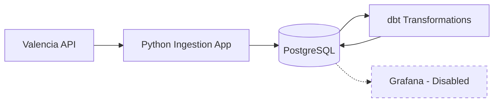
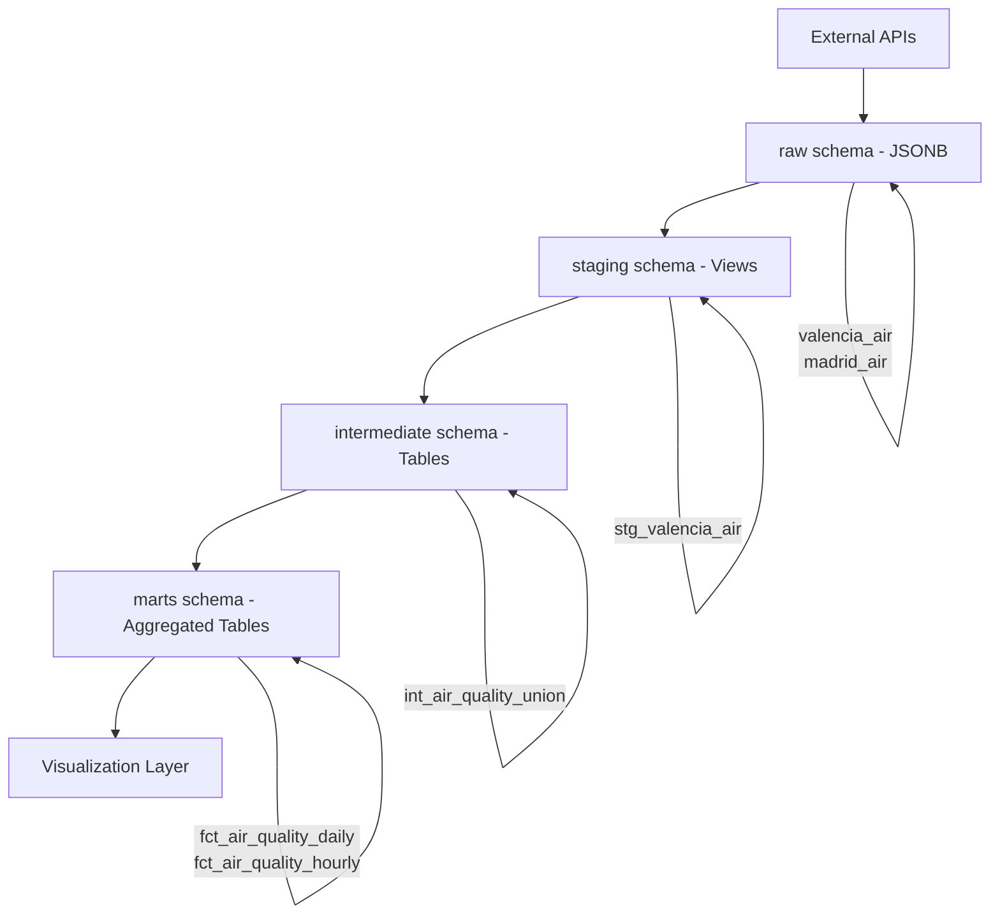
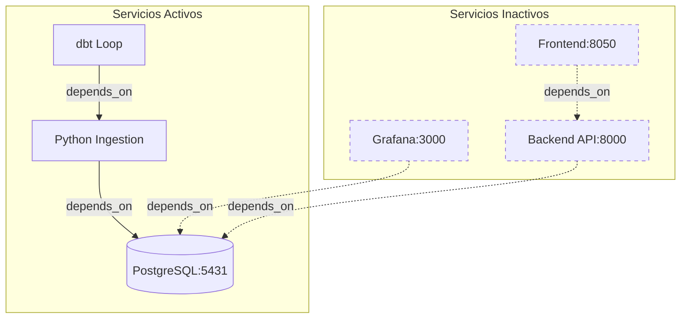

# DOCUMENTACIÓN TÉCNICA DEL PROYECTO

## Pipeline de Datos de Calidad del Aire

---

## 1. INTRODUCCIÓN

Este documento describe la arquitectura y funcionamiento de un pipeline de datos diseñado para recopilar, transformar y visualizar información sobre la calidad del aire en diversas ciudades españolas. El proyecto implementa una arquitectura de datos moderna siguiendo el patrón Medallion, utilizando tecnologías open-source como Docker, PostgreSQL, dbt y Grafana.

Este pipeline automatiza el proceso completo desde la extracción de datos de APIs públicas hasta la presentación de métricas agregadas en dashboards interactivos, pasando por múltiples capas de transformación y limpieza de datos.

---

## 2. ARQUITECTURA GENERAL DEL SISTEMA

El sistema sigue un flujo de datos secuencial que comienza con la extracción de información desde APIs públicas y procesa los datos a través de múltiples capas de transformación:

```
APIs Públicas → Aplicación Python → PostgreSQL → dbt
```

**Nota**: El sistema incluye soporte para una capa de visualización con Grafana, actualmente deshabilitada. El proyecto se enfoca en el pipeline ETL core (Extracción, Transformación y Carga de datos).

La arquitectura implementa el patrón Medallion con cuatro capas claramente diferenciadas:

- **Raw**: Almacenamiento de datos crudos sin procesar, tal como llegan desde las APIs externas
- **Staging**: Primera capa de limpieza donde se extraen y tipifican los campos del JSON
- **Intermediate**: Unificación de múltiples fuentes de datos en una estructura común
- **Marts**: Tablas analíticas agregadas y optimizadas para consultas de negocio

### 2.1 Diagramas de Arquitectura

#### 2.1.1 Arquitectura General del Sistema



#### 2.1.2 Flujo de Datos - Patrón Medallion



#### 2.1.3 Interacción de Servicios Docker



**Leyenda**:
- Líneas sólidas (→): Servicios activos y sus dependencias
- Líneas punteadas (-.->): Servicios deshabilitados
- Servicios activos: db, app, dbt
- Servicios inactivos: grafana, backend, frontend

---

## 3. COMPONENTES DEL SISTEMA

### 3.1 Base de Datos PostgreSQL

**Ubicación en docker-compose**: Líneas 2-8

La base de datos PostgreSQL actúa como repositorio central de información para todo el pipeline. Se utiliza la versión 17-alpine, que es una distribución ligera basada en Alpine Linux que reduce el tamaño de la imagen Docker manteniendo toda la funcionalidad necesaria.

**Configuración del servicio**:
- Imagen: postgres:17-alpine
- Puerto expuesto: 5431 (puerto del host que mapea al puerto interno 5432 del contenedor)
- Base de datos: air_quality_db
- Usuario: postgres
- Contraseña: postgres (definida en archivo .env para facilitar cambios sin modificar código)

**Razón del puerto 5431**: Se utiliza un puerto diferente al estándar (5432) para evitar conflictos si el desarrollador tiene otra instancia de PostgreSQL corriendo localmente en su máquina.

**Estructura de esquemas**:

La base de datos se organiza en cuatro esquemas según la arquitectura Medallion. Esta separación permite un procesamiento en capas donde cada nivel tiene una responsabilidad específica:

1. **raw**: Contiene las tablas con datos crudos en formato JSONB tal como llegan desde las APIs. No se aplica ninguna transformación, lo que garantiza que siempre tengamos acceso a los datos originales para auditoría o reprocesamiento. Actualmente incluye:
   - `raw.valencia_air`: Datos de estaciones de Valencia
   - `raw.madrid_air`: Datos de estaciones de Madrid (inactiva actualmente)

2. **staging**: Almacena vistas SQL que extraen campos específicos del JSONB y los tipifican correctamente (FLOAT para números, TIMESTAMP para fechas, TEXT para cadenas). Las vistas no duplican datos, solo proporcionan una forma estructurada de acceder a ellos.

3. **intermediate**: Contiene tablas físicas que unifican datos de múltiples ciudades en una estructura común. Esta capa añade la columna `city` para identificar el origen de cada registro y normaliza los nombres de campos entre diferentes fuentes.

4. **marts**: Tablas analíticas agregadas por diferentes dimensiones temporales (diario, horario). Estas tablas están optimizadas para consultas de negocio, calculando promedios, máximos y otras métricas relevantes.

---

### 3.2 Aplicación de Ingestión (Python)

**Ubicación**: Directorio `app/`
**Configuración en docker-compose**: Líneas 10-20

La aplicación de ingestión es el primer componente del pipeline. Su responsabilidad es extraer datos desde las APIs públicas gubernamentales e insertarlos en la capa raw de la base de datos sin aplicar ninguna transformación. Está construida en Python 3 y organizada en módulos especializados siguiendo el principio de separación de responsabilidades.

**Modelo de ejecución**: La aplicación se ejecuta una sola vez y termina (no tiene política de reinicio automático). Para automatizar la ingesta periódica, se requiere configuración adicional (ver sección 9.2).

**Tecnologías utilizadas**:
- `psycopg`: Librería moderna de PostgreSQL para Python (versión 3)
- `requests`: Para realizar peticiones HTTP a las APIs
- `xml.etree.ElementTree`: Para parsear respuestas XML de la API de Madrid

#### 3.2.1 Módulo config.py

Este archivo centraliza toda la configuración del sistema en un único punto, lo que facilita el mantenimiento y la migración entre entornos (desarrollo, staging, producción).

**Responsabilidades principales**:
- Lectura de variables de entorno desde el archivo `.env` usando `os.getenv()`
- Construcción de la cadena de conexión a PostgreSQL con formato URI
- Definición del diccionario `CITIES_CONFIG` que actúa como registro de ciudades disponibles

**Estructura del diccionario CITIES_CONFIG**:

Cada ciudad tiene tres propiedades obligatorias:
- `api_url`: URL completa de la API pública de la ciudad
- `table_name`: Nombre de la tabla en el esquema raw donde se almacenarán los datos
- `active`: Booleano que controla si la ciudad se procesa en esta ejecución

**Estado actual de ciudades**:
- **Valencia**: Activa (`active: True`) - Se está ingiriendo datos actualmente
- **Madrid**: Inactiva (`active: False`) - Implementada pero desactivada temporalmente
- **País Vasco**: Inactiva (`active: False`) - Estructura definida, pendiente de implementación

Esta arquitectura permite activar o desactivar ciudades cambiando un solo valor, sin necesidad de modificar código.

#### 3.2.2 Módulo database.py

Encapsula toda la lógica relacionada con la base de datos, proporcionando funciones reutilizables para conexión y creación de infraestructura.

**Función f_conexion_bd(db_url, db_nombre)**:

Esta función establece una conexión robusta a PostgreSQL con manejo de errores.

- Recibe la URL de conexión y un nombre descriptivo para logging
- Implementa lógica de reintentos: 10 intentos con pausas de 2 segundos entre cada uno
- Esto es crucial en Docker, donde PostgreSQL puede tardar varios segundos en estar completamente listo
- Retorna un objeto de conexión si tiene éxito
- Lanza una excepción `RuntimeError` si falla tras todos los intentos

**Función f_crear_tablas(database_url)**:

Esta función asegura que la infraestructura de base de datos exista antes de comenzar la ingesta.

- Se ejecuta al inicio de cada ejecución del orquestador
- Crea los cuatro esquemas (raw, staging, intermediate, marts) si no existen usando `CREATE SCHEMA IF NOT EXISTS`
- Crea las tablas raw para cada ciudad con la estructura estándar:
  - `id`: Clave primaria autoincrementable (SERIAL)
  - `station_id`: Identificador de la estación de medición (INTEGER)
  - `data_raw`: Campo JSONB que almacena el payload completo de la API sin modificar
  - `timestamp`: Marca temporal de la medición (TIMESTAMP WITH TIME ZONE)

El uso de `IF NOT EXISTS` hace que la función sea idempotente: se puede ejecutar múltiples veces sin causar errores.

#### 3.2.3 Módulo utils.py

Contiene funciones auxiliares reutilizables que se usan en múltiples partes del proyecto.

**Función f_llamada_api(api_url, api_nombre)**:

Esta función encapsula la lógica de llamadas HTTP con manejo robusto de errores.

- Realiza peticiones HTTP GET a las APIs públicas
- Implementa reintentos automáticos: 10 intentos con pausas de 2 segundos
- Esto hace el sistema resiliente ante caídas temporales de las APIs externas o problemas de red
- Captura excepciones de tipo `requests.exceptions.RequestException` que incluyen timeouts, errores de conexión, etc.
- Registra cada intento fallido en consola para facilitar el debugging
- Retorna el objeto `response` de la librería requests, que contiene status code, headers y contenido
- Lanza `RuntimeError` si todos los intentos fallan

Esta función es crítica porque las APIs externas pueden tener intermitencias, especialmente las gubernamentales que no están diseñadas para alta disponibilidad.

#### 3.2.4 Módulo main.py (Orquestador)

Este es el punto de entrada principal de la aplicación. Contiene la función `orquestador()` que coordina todo el proceso de ingestión de forma secuencial y controlada.

**Diccionario INGESTION_MAP**:

Mapea nombres de ciudades con sus funciones específicas de ingestión. Este patrón de diseño permite añadir nuevas ciudades simplemente registrando su función aquí:
```python
INGESTION_MAP = {
    "valencia": f_run_ingestion_valencia,
    "madrid": f_run_ingestion_madrid,
}
```

**Flujo de ejecución detallado**:

1. **Espera inicial (5 segundos)**:
   - Pausa deliberada para asegurar que PostgreSQL ha arrancado completamente en Docker
   - En Docker Compose, aunque `depends_on` establece orden de inicio, no garantiza que el servicio esté listo para aceptar conexiones
   - Esta espera evita errores de conexión en el primer intento

2. **Verificación de infraestructura**:
   - Llama a `f_crear_tablas()` para crear esquemas y tablas si no existen
   - Si esta etapa falla, se detiene toda la ejecución con `return` porque no tiene sentido continuar sin base de datos

3. **Iteración sobre ciudades configuradas**:
   - Recorre el diccionario `CITIES_CONFIG` obtenido desde config.py
   - Para cada ciudad, verifica la propiedad `active`
   - Solo procesa ciudades con `active: True`, saltando las demás

4. **Resolución de función mediante mapeo**:
   - Busca la función correspondiente en `INGESTION_MAP` usando el nombre de la ciudad como clave
   - Si no encuentra la función, registra un error pero continúa con la siguiente ciudad
   - Este diseño permite tener ciudades configuradas aunque aún no tengan implementación

5. **Ejecución de ingesta específica**:
   - Ejecuta la función de ingesta pasando `DATABASE_URL` y la `api_url` de la ciudad
   - La función se ejecuta dentro de un bloque try-except

6. **Manejo de errores resiliente**:
   - Si una ciudad falla, captura la excepción, registra el error en logs pero continúa con las siguientes
   - Esto evita que un problema en una ciudad detenga la ingesta de las demás
   - Implementa el principio de "fail gracefully"

#### 3.2.5 Módulo ingestion/valencia.py

Implementa la lógica específica para extraer datos de la API de Valencia que proporciona información sobre estaciones de contaminación atmosférica.

**Formato de la API**: La API de Valencia retorna JSON con la siguiente estructura:
```json
{
  "results": [
    {
      "objectid": 123,
      "nombre": "Nombre de la estación",
      "no2": 25.5,
      "pm10": 30.2,
      "fecha_carg": "2024-01-19T10:30:00Z",
      ...otros campos...
    }
  ]
}
```

**Proceso de ingesta paso a paso**:

1. **Conexión a base de datos**: Establece conexión usando `f_conexion_bd()`

2. **Llamada a la API**: Realiza petición GET a través de `f_llamada_api()`

3. **Parsing de respuesta**: Convierte la respuesta HTTP a diccionario Python con `.json()`

4. **Extracción del array de estaciones**: Obtiene la lista de estaciones desde `data.get('results', [])`

5. **Inserción iterativa**: Para cada estación en el array:
   - Extrae `objectid` como identificador único de la estación
   - Guarda el objeto JSON completo en el campo `data_raw` usando el tipo `Json()` de psycopg
   - Extrae el timestamp desde el campo `fecha_carg`
   - Ejecuta INSERT en la tabla `raw.valencia_air`

6. **Confirmación de transacción**: Si todas las inserciones son exitosas, ejecuta `connection.commit()`

7. **Rollback en caso de error**: Si cualquier inserción falla, ejecuta `connection.rollback()` para deshacer todos los cambios

**Aspectos técnicos importantes**:
- Usa `Json()` de psycopg para manejar correctamente el tipo JSONB de PostgreSQL
- El cursor se usa dentro de un context manager (`with`) que lo cierra automáticamente
- El bloque `finally` garantiza que la conexión se cierre incluso si hay errores
- Todas las inserciones ocurren en una sola transacción: o se guardan todas o ninguna

#### 3.2.6 Módulo ingestion/madrid.py

Implementa la lógica para extraer datos de la API de Madrid, que a diferencia de Valencia, retorna XML en lugar de JSON. Actualmente está implementada pero inactiva (`active: False` en config.py).

**Formato de la API**: La API de Madrid retorna XML con esta estructura:
```xml
<response>
  <medicion>
    <punto_muestreo>28079004_8_16</punto_muestreo>
    <fecha>2024-01-19</fecha>
    <hora>10</hora>
    <valor>25.5</valor>
    ...otros campos...
  </medicion>
</response>
```

**Diferencias clave con Valencia**:

1. **Parsing XML**: Utiliza `xml.etree.ElementTree` para parsear el contenido XML en lugar de `.json()`

2. **Extracción de elementos**: Busca todos los elementos `<medicion>` usando `root.findall('medicion')`

3. **Conversión a diccionario**: Para cada elemento `<medicion>`, extrae todos sus hijos y los convierte a un diccionario Python:
   ```python
   data_dict = {child.tag: child.text for child in med}
   ```

4. **Extracción del station_id**: El identificador de estación está codificado en el campo `punto_muestreo` con formato `estacion_magnitud_tecnica` (ejemplo: `28079004_8_16`). Se extrae dividiendo por `_` y tomando el primer elemento:
   ```python
   station_id = punto_muestreo.split('_')[0]  # Resultado: "28079004"
   ```

5. **Construcción del timestamp**: La fecha y hora vienen en campos separados, se concatenan para formar un timestamp válido:
   ```python
   timestamp_str = f"{fecha} {hora}:00"  # Resultado: "2024-01-19 10:00"
   ```

El resto del proceso es idéntico a Valencia: se inserta el diccionario en formato JSONB en `raw.madrid_air` y se confirma la transacción.

---

### 3.3 Transformaciones con dbt

**Ubicación**: Directorio `dbt/air_quality_dbt/`
**Configuración en docker-compose**: Líneas 22-35

dbt (data build tool) es una herramienta moderna de transformación de datos que permite escribir transformaciones SQL modulares y testeables. En este proyecto, dbt es responsable de tomar los datos crudos de la capa raw y transformarlos progresivamente hasta crear tablas analíticas listas para visualización.

**Configuración especial en Docker**:

El docker-compose sobrescribe el `entrypoint` de la imagen oficial de dbt con un script shell personalizado:
```bash
sleep 20;
while true; do
  dbt run && dbt docs generate --static;
  echo 'Transformación completada. Esperando 5 minutos...';
  sleep 300;
done
```

**¿Por qué sobrescribir el entrypoint?**
- La imagen oficial de dbt está diseñada para ejecutar un solo comando y terminar
- Nosotros necesitamos un proceso que se ejecute continuamente
- El script implementa un bucle infinito que ejecuta transformaciones cada 5 minutos

**Comportamiento del servicio**:
1. **Espera inicial de 20 segundos**: Da tiempo a que la aplicación Python inserte los primeros datos en raw
2. **Ejecución de transformaciones**: Ejecuta `dbt run` que materializa todos los modelos definidos
3. **Generación de documentación**: Ejecuta `dbt docs generate --static` que crea documentación HTML de todos los modelos
4. **Espera de 5 minutos**: `sleep 300` antes de repetir el ciclo
5. **Bucle infinito**: El `while true` hace que este proceso se repita indefinidamente

#### 3.3.1 Configuración de conexión (profiles.yml)

El archivo `profiles.yml` define cómo dbt se conecta a la base de datos PostgreSQL. Este archivo es fundamental porque dbt necesita saber dónde ejecutar las transformaciones SQL.

**Estructura del perfil**:
```yaml
air_quality_dbt:
  outputs:
    dev:
      type: postgres
      host: db           # Nombre del servicio Docker (no localhost)
      port: 5432         # Puerto interno del contenedor
      user: postgres
      pass: postgres
      dbname: air_quality_db
      schema: public
      threads: 1
  target: dev
```

**Aspectos importantes**:

- **host: db**: Usamos el nombre del servicio Docker, no `localhost`. Dentro de la red de Docker Compose, los servicios se comunican por nombre.
- **port: 5432**: Usamos el puerto interno del contenedor (5432), no el puerto expuesto del host (5431).
- **target: dev**: Indica qué configuración usar por defecto. En proyectos más grandes se tendrían múltiples targets (dev, staging, prod).
- **threads: 1**: Número de consultas SQL que dbt puede ejecutar en paralelo. Con 1 thread, los modelos se ejecutan secuencialmente.
- **schema: public**: Esquema por defecto, aunque los modelos pueden sobrescribir esto (como hacemos con staging, intermediate, marts).

#### 3.3.2 Configuración del proyecto (dbt_project.yml)

El archivo `dbt_project.yml` es el archivo de configuración principal del proyecto dbt. Define cómo se deben materializar y organizar los modelos.

**Configuración de materialización por capa**:

```yaml
models:
  air_quality_dbt:
    staging:
      +materialized: view
      +schema: staging
      +tags: ["staging"]

    intermediate:
      +materialized: table
      +schema: intermediate
      +tags: ["intermediate"]

    marts:
      +materialized: table
      +schema: marts
      +tags: ["marts"]
```

**Explicación de cada capa**:

**Staging**:
- **Materialización: view**: Los modelos staging se crean como vistas SQL, no tablas físicas
- **Ventaja de las vistas**: No duplican datos, solo proporcionan una forma estructurada de acceder a raw
- **Desventaja**: Las consultas son ligeramente más lentas porque se ejecutan cada vez
- **Esquema destino: staging**: dbt creará automáticamente un esquema llamado `staging` y pondrá allí estas vistas
- **Tags**: Permiten ejecutar solo modelos staging con `dbt run --select tag:staging`

**Intermediate**:
- **Materialización: table**: Se crean como tablas físicas en la base de datos
- **Ventaja**: Consultas rápidas porque los datos ya están materializados
- **Desventaja**: Ocupan más espacio en disco
- **Uso**: Esta capa unifica múltiples fuentes y hace transformaciones complejas, por eso se materializa como tabla

**Marts**:
- **Materialización: table**: Tablas físicas optimizadas para consultas de negocio
- **Razón**: Son las tablas que consulta Grafana, deben ser rápidas
- **Contienen**: Métricas agregadas (promedios, máximos, conteos) calculadas con GROUP BY
- **Esquema destino: marts**: Todas las tablas analíticas van al esquema `marts`

#### 3.3.3 Capa Staging

**Archivo**: models/staging/stg_valencia_air.sql

**Propósito**: Extraer y tipificar campos desde el JSONB crudo.

**Proceso**:
1. Lee desde raw.valencia_air usando la función source() de dbt
2. Utiliza jsonb_extract_path_text() para extraer cada campo del JSON
3. Realiza conversión de tipos explícita:
   - TEXT para identificadores y nombres
   - FLOAT para magnitudes de contaminantes
   - TIMESTAMP WITH TIME ZONE para fechas

**Campos extraídos**:
- station_id: Identificador de estación
- station_name: Nombre de la estación
- no2: Dióxido de nitrógeno
- pm10: Material particulado de 10 micras
- pm25: Material particulado de 2.5 micras
- so2: Dióxido de azufre
- o3: Ozono
- co: Monóxido de carbono
- air_quality_status: Estado de calidad del aire
- measure_timestamp: Momento de la medición
- ingested_at: Momento de ingesta en la base de datos

**Archivo**: models/staging/sources.yml

Define las fuentes de datos que dbt puede referenciar:

- Nombre de fuente: air_quality
- Base de datos: air_quality_db
- Esquema: raw
- Tablas:
  - valencia_air (con tests de not_null y unique en station_id)
  - madrid_air (comentada, inactiva)

#### 3.3.4 Capa Intermediate

**Archivo**: models/intermediate/int_air_quality_union.sql

**Propósito**: Unificar datos de múltiples ciudades en una estructura común.

**Estrategia**:

1. **CTE valencia_data**:
   - Selecciona todos los campos desde stg_valencia_air
   - Añade columna literal 'Valencia' como city

2. **CTE madrid_placeholder**:
   - Define la estructura con los mismos campos
   - Usa NULL con tipado explícito para cada columna
   - Incluye WHERE FALSE para que no retorne filas
   - Permite que la estructura esté preparada sin datos reales

3. **Unión final**:
   - Usa UNION ALL para combinar ambas CTEs
   - UNION ALL es más eficiente que UNION porque no elimina duplicados

**Resultado**: Tabla unificada con columna city que permite diferenciar el origen de cada registro.

#### 3.3.5 Capa Marts

**Archivo**: models/marts/fct_air_quality_daily.sql

**Propósito**: Agregar métricas por día para análisis de tendencias históricas.

**Transformaciones aplicadas**:

1. Agrupa por:
   - measure_date (fecha sin hora)
   - city
   - station_id
   - station_name

2. Calcula métricas agregadas:
   - Promedios diarios: AVG(no2), AVG(pm10), AVG(pm25)
   - Redondea a 2 decimales con ROUND()
   - Picos máximos: MAX(no2), MAX(pm10)

3. Filtra registros con timestamp nulo

4. Ordena por fecha descendente y ciudad

**Uso**: Esta tabla es ideal para dashboards que muestren evolución diaria de contaminantes.

**Archivo**: models/marts/fct_air_quality_hourly.sql

Similar a la tabla diaria pero con agregación por hora (no mostrado en el análisis pero mencionado en la estructura).

---

### 3.4 Visualización con Grafana

**Configuración en docker-compose**: Líneas 37-51

⚠️ **NOTA IMPORTANTE**: El servicio Grafana está actualmente **deshabilitado** en docker-compose.yml (comentado). El proyecto se enfoca en el pipeline ETL core. Para habilitar Grafana, ver sección 5.7.

**Estado actual**: El servicio Grafana está comentado en el archivo docker-compose.yml para simplificar el despliegue inicial y enfocarse en la infraestructura de datos core (ingesta y transformación).

**Configuración del servicio** (cuando está habilitado):
- Imagen: grafana/grafana-oss:latest
- Puerto expuesto: 3000
- Usuario administrador: admin
- Contraseña: admin (puede cambiarse en primer acceso)

**Volúmenes montados**:
- ./grafana/provisioning/datasources: Configuración automática de conexión a PostgreSQL
- ./grafana/provisioning/dashboards: Definición de dashboards pre-configurados
- ./grafana/dashboards: Archivos JSON de dashboards
- grafana_data: Volumen persistente para datos de configuración

**Nota técnica**: Los archivos de provisionamiento (datasource.yml, dashboards.yml, dashboard JSON) necesitan ser creados antes de habilitar el servicio Grafana.

**Fuente de datos**:
Cuando esté habilitado, Grafana conectará directamente al servicio "db" dentro de la red Docker, consultando las tablas del esquema marts para obtener datos agregados listos para visualización.

**Alternativas actuales de visualización**:
Actualmente, la exploración de datos se realiza mediante consultas SQL directas a PostgreSQL (ver sección 6.2).

---

## 4. FLUJO COMPLETO DE DATOS

El sistema procesa datos siguiendo este flujo secuencial:

**Fase 1: Extracción (cada ejecución de la app)**

1. El orquestador (main.py) verifica la infraestructura de base de datos
2. Lee la configuración de ciudades activas desde config.py
3. Para cada ciudad activa:
   - Llama a su API específica
   - Recibe JSON o XML
   - Inserta datos crudos en tablas raw.* con formato JSONB

**Fase 2: Transformación (cada 5 minutos, automático con dbt)**

1. Staging:
   - stg_valencia_air extrae campos específicos del JSONB
   - Tipifica cada campo correctamente
   - Materializa como vista SQL

2. Intermediate:
   - int_air_quality_union unifica todas las ciudades
   - Añade dimensión city
   - Materializa como tabla física

3. Marts:
   - fct_air_quality_daily agrega por día
   - fct_air_quality_hourly agrega por hora
   - Ambas materializadas como tablas físicas

**Fase 3: Consulta y Visualización**

**Método actual**: Consultas SQL directas a las tablas marts.* mediante psql o herramientas de gestión de bases de datos.

**Método alternativo** (Grafana - deshabilitado): Cuando se habilite Grafana, consultará las tablas marts.* en tiempo real y mostrará:
- Evolución temporal de contaminantes
- Comparación entre estaciones
- Alertas de picos de contaminación
- Tendencias históricas

Ver sección 6.2 para ejemplos de consultas SQL útiles para explorar los datos.

---

## 5. INSTRUCCIONES DE DESPLIEGUE

### 5.1 Requisitos previos

Antes de iniciar el proyecto, asegúrate de tener:

- **Docker Desktop** instalado y en ejecución (abrir la aplicación Docker Desktop)
- **Docker Compose** instalado (viene incluido con Docker Desktop en Windows y Mac)
- **Puertos libres**: 3000 (Grafana) y 5431 (PostgreSQL)
  
  - Verificar que no estén ocupados por otros proyectos o servicios
  - En Windows: `netstat -ano | findstr :3000`
  - En Linux/Mac: `lsof -i :3000`

### 5.2 Iniciar el sistema completo

Desde el directorio raíz del proyecto (donde está el archivo `docker-compose.yml`), ejecutar:

```bash
docker-compose up -d
```

**Significado del comando**:
- `docker-compose up`: Inicia todos los servicios definidos en docker-compose.yml


- `-d` (detached): Ejecuta los contenedores en segundo plano, liberando la terminal para seguir trabajando


**Servicios que se inician** (configuración actual):
1. **Base de datos PostgreSQL** (puerto 5431)
2. **Aplicación de ingestión Python** (ejecuta una vez y termina)
3. **Servicio dbt** (bucle continuo de transformaciones cada 5 minutos)

**Servicios deshabilitados** (comentados en docker-compose.yml):
- Servidor Grafana (puerto 3000)
- Backend API (puerto 8000)
- Frontend Dashboard (puerto 8050)

Para habilitar servicios adicionales, ver sección 5.7.

**Primera ejecución**: La primera vez puede tardar varios minutos porque Docker debe descargar las imágenes base (postgres, dbt).

### 5.3 Verificar estado de servicios

Para verificar que todos los contenedores están corriendo correctamente:

```bash
docker-compose ps
```

**Salida esperada** (configuración actual):
```
NAME           STATUS          PORTS
db             Up 2 minutes    0.0.0.0:5431->5432/tcp
app            Exited (0)
dbt            Up 2 minutes
```

**Interpretación**:
- `Up`: El contenedor está corriendo activamente
- `Exited (0)`: El contenedor terminó correctamente (comportamiento esperado para app que ejecuta una sola vez)
- `Exited (1)`: El contenedor terminó con error (revisar logs con `docker-compose logs app`)

**Nota**: Solo verás 3 servicios listados (db, app, dbt) ya que Grafana, backend y frontend están deshabilitados.

### 5.4 Consultar logs

Los logs son fundamentales para diagnosticar problemas y verificar que todo funciona correctamente.

**Ver logs de todos los servicios**:
```bash
docker-compose logs -f
```

**Ver logs de un servicio específico**:
```bash
docker-compose logs -f app      # Ver si la ingesta funcionó
docker-compose logs -f dbt      # Ver transformaciones
docker-compose logs -f db       # Ver consultas SQL
docker-compose logs -f grafana  # Ver inicio de Grafana
```

**Significado del parámetro `-f` (follow)**:
- Muestra los logs en tiempo real a medida que se generan
- Ideal para ver si la ingesta de la API funciona o si hay errores
- Presionar `Ctrl+C` para salir del modo follow


**Ver solo las últimas líneas**:
```bash
docker-compose logs --tail=50 app  # Últimas 50 líneas
```

### 5.5 Reconstruir imágenes tras cambios en código

Si modificas archivos Python (`main.py`, `database.py`, etc.) o el `Dockerfile`, Docker necesita reconstruir la imagen para incluir los cambios:

```bash
docker-compose build      # Reconstruye las imágenes
docker-compose up -d      # Reinicia con las nuevas imágenes
```


**Flujo completo de actualización**:
```bash
# 1. Detener servicios
docker-compose down

# 2. Reconstruir imágenes
docker-compose build

# 3. Iniciar con nuevas imágenes
docker-compose up -d

# 4. Verificar logs
docker-compose logs -f app
```

### 5.6 Detener el sistema

**Detener sin eliminar datos**:
```bash
docker-compose down
```
Esto detiene y elimina los contenedores, pero mantiene los volúmenes (datos de PostgreSQL y Grafana se conservan).

**Reseteo completo** (eliminar también datos):
```bash
docker-compose down -v
```

**Significado del parámetro `-v` (volumes)**:
- Elimina los volúmenes de Docker donde se guardan datos persistentes
- Se usa cuando quieres empezar desde cero
- **Precaución**: Borra todos los datos de la base de datos y configuraciones de Grafana


### 5.7 Configuración de Servicios Opcionales

El proyecto incluye servicios adicionales que están deshabilitados por defecto. Esta sección explica cómo habilitarlos según tus necesidades.

#### 5.7.1 Habilitar Grafana

**Paso 1**: Descomentar el servicio en docker-compose.yml (líneas 37-51)

Elimina los caracteres `#` al inicio de cada línea del bloque de Grafana.

**Paso 2**: Crear archivos de provisionamiento

Antes de iniciar Grafana, necesitas crear los archivos de configuración:

```bash
mkdir -p grafana/provisioning/datasources
mkdir -p grafana/provisioning/dashboards
mkdir -p grafana/dashboards
```

Crear `grafana/provisioning/datasources/datasource.yml`:
```yaml
apiVersion: 1
datasources:
  - name: PostgreSQL
    type: postgres
    url: db:5432
    database: air_quality_db
    user: postgres
    secureJsonData:
      password: postgres
    jsonData:
      sslmode: disable
      postgresVersion: 1700
```

Crear `grafana/provisioning/dashboards/dashboards.yml`:
```yaml
apiVersion: 1
providers:
  - name: 'Air Quality Dashboards'
    folder: ''
    type: file
    options:
      path: /var/lib/grafana/dashboards
```

**Paso 3**: Iniciar el servicio

```bash
docker-compose up -d grafana
```

**Paso 4**: Acceder a Grafana

- URL: http://localhost:3000
- Usuario: admin
- Contraseña: admin

#### 5.7.2 Habilitar Backend API

**Requisito**: El directorio `backend/` contiene el código de la API FastAPI.

**Paso 1**: Descomentar el servicio en docker-compose.yml (líneas 53-63)

**Paso 2**: Verificar que existe `backend/Dockerfile` y `backend/requirements.txt`

**Paso 3**: Iniciar el servicio

```bash
docker-compose up -d backend
```

**Paso 4**: Acceder a la documentación de la API

- URL: http://localhost:8000/docs (Swagger UI)
- URL: http://localhost:8000/redoc (ReDoc)

#### 5.7.3 Habilitar Frontend Dashboard

**Requisito**: Requiere que el backend esté activo.

**Paso 1**: Habilitar backend primero (ver 5.7.2)

**Paso 2**: Descomentar el servicio frontend en docker-compose.yml (líneas 65-76)

**Paso 3**: Iniciar el servicio

```bash
docker-compose up -d frontend
```

**Paso 4**: Acceder al dashboard

- URL: http://localhost:8050

#### 5.7.4 Iniciar servicios selectivos

Puedes iniciar solo los servicios que necesites:

```bash
# Solo base de datos y app de ingesta
docker-compose up -d db app

# Base de datos, app, dbt (configuración actual)
docker-compose up -d db app dbt

# Todo incluyendo visualización
docker-compose up -d db app dbt grafana

# Pipeline completo con backend y frontend
docker-compose up -d db app dbt backend frontend
```

### 5.8 Configuración de Variables de Entorno

El proyecto utiliza un archivo `.env` para gestionar configuraciones sensibles y específicas del entorno.

#### 5.8.1 Variables requeridas

Crear archivo `.env` en la raíz del proyecto:

```bash
# Configuración de PostgreSQL
POSTGRES_USER=postgres
POSTGRES_PASSWORD=postgres
POSTGRES_DB=air_quality_db
POSTGRES_HOST=db
POSTGRES_PORT=5432

# Puerto expuesto al host (evita conflictos con PostgreSQL local)
POSTGRES_EXTERNAL_PORT=5431

# Configuración de Grafana (si está habilitado)
GF_SECURITY_ADMIN_PASSWORD=admin

# Configuración de Backend API (si está habilitado)
DATABASE_URL=postgresql://postgres:postgres@db:5432/air_quality_db
```

#### 5.8.2 Variables opcionales

```bash
# Logs y debugging
PYTHONUNBUFFERED=1
LOG_LEVEL=INFO

# Configuración de ingesta
INGESTION_INTERVAL=300  # Segundos entre ejecuciones (si se automatiza)
```

#### 5.8.3 Plantilla de .env

El repositorio debería incluir un archivo `.env.example`:

```bash
# Copiar el archivo de ejemplo
cp .env.example .env

# Editar según tu configuración
nano .env  # o usar tu editor preferido
```

**Nota de seguridad**: El archivo `.env` está incluido en `.gitignore` y nunca debe subirse al repositorio para proteger credenciales.

### 5.9 Gestión de Puertos

#### 5.9.1 Tabla de puertos del proyecto

| Servicio       | Puerto Interno | Puerto Host | Estado    | Propósito                      |
|----------------|----------------|-------------|-----------|--------------------------------|
| PostgreSQL     | 5432           | 5431        | Activo    | Base de datos                  |
| Grafana        | 3000           | 3000        | Inactivo  | Visualización                  |
| Backend API    | 8000           | 8000        | Inactivo  | API REST                       |
| Frontend       | 8050           | 8050        | Inactivo  | Dashboard interactivo          |

#### 5.9.2 Verificar disponibilidad de puertos

**En Windows**:
```bash
netstat -ano | findstr :5431
netstat -ano | findstr :3000
netstat -ano | findstr :8000
netstat -ano | findstr :8050
```

**En Linux/Mac**:
```bash
lsof -i :5431
lsof -i :3000
lsof -i :8000
lsof -i :8050
```

Si un puerto está ocupado, no aparecerá ninguna salida.

#### 5.9.3 Cambiar puertos en caso de conflicto

Si un puerto está ocupado, edita `docker-compose.yml`:

**Ejemplo - Cambiar puerto de PostgreSQL de 5431 a 5433**:
```yaml
db:
  ports:
    - "5433:5432"  # Cambiar el primer número (puerto host)
```

**Ejemplo - Cambiar puerto de Grafana de 3000 a 3001**:
```yaml
grafana:
  ports:
    - "3001:3000"  # Cambiar el primer número
```

**Importante**: Después de cambiar puertos, recuerda:
1. Actualizar el archivo `.env` si es necesario
2. Actualizar las conexiones en tu código/herramientas
3. Reiniciar los servicios: `docker-compose restart`

#### 5.9.4 Liberar puertos ocupados

**Identificar qué proceso usa el puerto** (Windows):
```bash
netstat -ano | findstr :5431
# La última columna muestra el PID del proceso
```

**Terminar el proceso** (Windows - ejecutar como administrador):
```bash
taskkill /PID <número_pid> /F
```

**En Linux/Mac**:
```bash
# Identificar proceso
lsof -i :5431
# Terminar proceso
kill -9 <PID>
```

---

## 6. EXTRACCIÓN Y CONSULTA DE INFORMACIÓN

### 6.1 Conexión directa a PostgreSQL

### 6.1.1 Desde la línea de comandos del host:

#### Ok varios cosas a explicar en caso de que no se tenga instalado PostgreSQL 

- Instalar psql localmente (si quieres usarlo desde fuera)

En cualquier sistema hay opcion Windows x86-64 y Mac OS X:
- Instalar PostgreSQL completo:

Pasos

- Descarga PostgreSQL desde https://www.enterprisedb.com/downloads/postgres-postgresql-downloads
- Durante la instalación, marca solo "Command Line Tools"
- Reinicia la terminal

Ahora si puedes aplicar el comando que esta debajo

```bash
psql -h localhost -p 5431 -U postgres -d air_quality_db
```
Parámetros explicados:

-h localhost: Conecta al host local

-p 5431: Usa el puerto 5431 (el puerto expuesto en docker-compose)

-U postgres: Usuario postgres

-d air_quality_db: Base de datos air_quality_db

Cuando ejecutes el comando, te pedirá la contraseña: postgres

#### Contraseña: ----------->  postgres  <----------- AQUI 

### 6.1.2 Desde el contenedor de Docker:

```bash
docker-compose exec db psql -U postgres -d air_quality_db
``` 

Explicación:

- docker-compose exec db: Ejecuta un comando dentro del contenedor db

- psql -U postgres -d air_quality_db: Conecta a la base de datos

### 6.2 Consultas útiles

**Ver datos crudos recientes**:
```sql
SELECT
    station_id,
    data_raw->>'nombre' as estacion,
    timestamp
FROM raw.valencia_air
ORDER BY timestamp DESC
LIMIT 10;
```

**Ver datos limpios en staging**:
```sql
SELECT
    station_name,
    no2,
    pm10,
    pm25,
    measure_timestamp
FROM staging.stg_valencia_air
ORDER BY measure_timestamp DESC
LIMIT 10;
```

**Estadísticas diarias**:
```sql
SELECT
    measure_date,
    station_name,
    daily_avg_no2,
    daily_avg_pm10,
    max_pm10_peak
FROM marts.fct_air_quality_daily
WHERE measure_date >= CURRENT_DATE - INTERVAL '7 days'
ORDER BY measure_date DESC, daily_avg_pm10 DESC;
```

**Conteo de registros por capa**:
```sql
SELECT 'raw' as capa, COUNT(*) as registros FROM raw.valencia_air
UNION ALL
SELECT 'staging', COUNT(*) FROM staging.stg_valencia_air
UNION ALL
SELECT 'marts_daily', COUNT(*) FROM marts.fct_air_quality_daily;
```

**Identificar estaciones con peor calidad**:
```sql
SELECT
    station_name,
    city,
    daily_avg_pm10,
    daily_avg_no2,
    measure_date
FROM marts.fct_air_quality_daily
WHERE measure_date = CURRENT_DATE
ORDER BY daily_avg_pm10 DESC
LIMIT 5;
```

### 6.3 Diccionario de Datos y Contaminantes

Esta sección proporciona información detallada sobre los contaminantes atmosféricos monitoreados y su impacto en la salud pública.

#### 6.3.1 Introducción a la Calidad del Aire

La calidad del aire se mide monitoreando concentraciones de contaminantes específicos que pueden afectar la salud humana y el medio ambiente. El proyecto recopila datos de estaciones de medición que registran niveles de seis contaminantes principales, comparándolos con los límites establecidos por la Organización Mundial de la Salud (OMS) y la Unión Europea.

**Unidades de medición**: Todos los contaminantes se miden en **microgramos por metro cúbico (µg/m³)**, que representa la masa del contaminante por unidad de volumen de aire.

#### 6.3.2 Contaminantes Monitoreados

##### NO2 (Dióxido de Nitrógeno / Nitrogen Dioxide)

**Descripción**: Gas tóxico de color marrón rojizo con olor fuerte y desagradable.

**Fuentes principales**:
- Emisiones de vehículos (especialmente diésel)
- Procesos de combustión industrial
- Centrales eléctricas
- Calefacción doméstica

**Efectos en la salud**:
- Corto plazo: Irritación de las vías respiratorias, tos, dificultad para respirar
- Largo plazo: Reducción de la función pulmonar, aumento de infecciones respiratorias
- Agravamiento de asma y enfermedades cardiovasculares
- Especialmente peligroso para niños, ancianos y personas con enfermedades respiratorias

**Límites de referencia**:
- **OMS (2021)**:
  - Media anual: 10 µg/m³
  - Media 24 horas: 25 µg/m³
- **Unión Europea (Directiva 2008/50/CE)**:
  - Media anual: 40 µg/m³
  - Media horaria: 200 µg/m³ (no superar más de 18 veces/año)
- **Umbral de alerta**: >400 µg/m³ (3 horas consecutivas)

**Niveles típicos en áreas urbanas**: 20-90 µg/m³

---

##### PM10 (Material Particulado de 10 micras / Particulate Matter 10)

**Descripción**: Partículas sólidas o líquidas suspendidas en el aire con diámetro menor a 10 micrómetros. Son lo suficientemente pequeñas para ser inhaladas y llegar a los pulmones.

**Fuentes principales**:
- Combustión de combustibles fósiles (vehículos, industria)
- Polvo de construcción y demolición
- Erosión del suelo y resuspensión de polvo de carreteras
- Polen y esporas (fuentes naturales)
- Desgaste de neumáticos y frenos

**Efectos en la salud**:
- Las partículas pueden penetrar hasta los pulmones
- Problemas respiratorios: bronquitis, asma, reducción de capacidad pulmonar
- Efectos cardiovasculares: aumento de presión arterial, infartos
- Mortalidad prematura en personas con enfermedades cardiopulmonares
- Pueden transportar sustancias tóxicas adheridas (metales pesados, compuestos orgánicos)

**Límites de referencia**:
- **OMS (2021)**:
  - Media anual: 15 µg/m³
  - Media 24 horas: 45 µg/m³
- **Unión Europea (Directiva 2008/50/CE)**:
  - Media anual: 40 µg/m³
  - Media 24 horas: 50 µg/m³ (no superar más de 35 veces/año)

**Niveles típicos en áreas urbanas**: 20-70 µg/m³

---

##### PM2.5 (Material Particulado de 2.5 micras / Particulate Matter 2.5)

**Descripción**: Partículas finas con diámetro menor a 2.5 micrómetros. Son extremadamente pequeñas (aproximadamente 1/30 del grosor de un cabello humano) y más peligrosas que PM10 porque pueden penetrar más profundamente en el sistema respiratorio.

**Fuentes principales**:
- Emisiones vehicular (especialmente motores diésel)
- Combustión de biomasa y madera
- Procesos industriales (fundiciones, refinerías)
- Formación secundaria en la atmósfera por reacciones químicas
- Incendios forestales
- Humo de tabaco

**Efectos en la salud** (más graves que PM10):
- Penetración profunda hasta los alvéolos pulmonares
- Paso al torrente sanguíneo, afectando todos los órganos
- Enfermedades cardíacas: infartos, arritmias, insuficiencia cardíaca
- Accidentes cerebrovasculares (ACV)
- Cáncer de pulmón (clasificado como carcinógeno por la OMS)
- Desarrollo de diabetes tipo 2
- Efectos en embarazo: bajo peso al nacer, parto prematuro
- Deterioro cognitivo y demencia en adultos mayores

**Límites de referencia**:
- **OMS (2021)**:
  - Media anual: 5 µg/m³
  - Media 24 horas: 15 µg/m³
- **Unión Europea (Directiva 2008/50/CE)**:
  - Media anual: 25 µg/m³ (objetivo: 20 µg/m³ para 2030)

**Niveles típicos en áreas urbanas**: 10-35 µg/m³

**Nota importante**: PM2.5 es considerado el contaminante atmosférico más peligroso para la salud humana según la OMS.

---

##### SO2 (Dióxido de Azufre / Sulfur Dioxide)

**Descripción**: Gas incoloro con olor penetrante e irritante.

**Fuentes principales**:
- Combustión de combustibles fósiles con contenido de azufre (carbón, petróleo)
- Refinerías de petróleo
- Industrias metalúrgicas (fundición de metales)
- Erupciones volcánicas (fuente natural)

**Efectos en la salud**:
- Irritación del sistema respiratorio
- Dificultad para respirar, especialmente en asmáticos
- Inflamación de las vías respiratorias
- Agravamiento de enfermedades cardiovasculares
- Contribuye a la formación de partículas finas (PM2.5 secundario)

**Efectos ambientales**:
- Principal causante de lluvia ácida
- Daño a vegetación y ecosistemas

**Límites de referencia**:
- **OMS (2021)**:
  - Media 24 horas: 40 µg/m³
- **Unión Europea (Directiva 2008/50/CE)**:
  - Media diaria: 125 µg/m³ (no superar más de 3 veces/año)
  - Media horaria: 350 µg/m³ (no superar más de 24 veces/año)
- **Umbral de alerta**: >500 µg/m³ (3 horas consecutivas)

**Niveles típicos en áreas urbanas**: 5-50 µg/m³ (en descenso debido a regulaciones sobre azufre en combustibles)

---

##### O3 (Ozono Troposférico / Tropospheric Ozone)

**Descripción**: Gas altamente reactivo. A diferencia del ozono estratosférico (que nos protege de radiación UV), el ozono troposférico a nivel del suelo es un contaminante perjudicial.

**Fuentes**:
- No se emite directamente, se forma por reacciones fotoquímicas
- Reacción entre NOx (óxidos de nitrógeno) y COV (compuestos orgánicos volátiles) bajo luz solar
- Niveles más altos en verano y en horas de máxima radiación solar (mediodía-tarde)

**Efectos en la salud**:
- Irritación de ojos y vías respiratorias
- Reducción de la función pulmonar
- Agravamiento de asma y enfermedades respiratorias
- Inflamación pulmonar
- Mayor susceptibilidad a infecciones respiratorias
- Efectos cardiovasculares en exposiciones prolongadas

**Efectos ambientales**:
- Daño a cultivos y vegetación
- Reducción de productividad agrícola

**Límites de referencia**:
- **OMS (2021)**:
  - Pico estacional: 60 µg/m³ (media 8 horas)
- **Unión Europea (Directiva 2008/50/CE)**:
  - Valor objetivo: 120 µg/m³ (media 8 horas, no superar más de 25 días/año)
  - Umbral de información: 180 µg/m³ (media horaria)
  - Umbral de alerta: 240 µg/m³ (media horaria)

**Niveles típicos en áreas urbanas**:
- Invierno: 20-50 µg/m³
- Verano: 80-180 µg/m³ (puede superar límites en episodios de calor)

**Particularidad**: Es el único contaminante que aumenta en áreas alejadas del tráfico (parques, zonas residenciales) porque en zonas de tráfico intenso, el NO emitido por vehículos consume el O3.

---

##### CO (Monóxido de Carbono / Carbon Monoxide)

**Descripción**: Gas incoloro, inodoro e insípido, lo que lo hace particularmente peligroso.

**Fuentes principales**:
- Combustión incompleta de combustibles (gasolina, diésel, gas, madera)
- Emisiones vehiculares (especialmente en arranques en frío y atascos)
- Calefacciones y calderas mal ajustadas
- Humo de tabaco

**Efectos en la salud**:
- Se une a la hemoglobina en la sangre, reduciendo el transporte de oxígeno
- Dolores de cabeza, mareos, náuseas en exposiciones bajas
- Pérdida de conciencia y muerte en exposiciones altas (intoxicación)
- Efectos cardiovasculares: aumento del riesgo de infarto
- Afectación del desarrollo fetal en embarazadas
- Reducción de reflejos y capacidad cognitiva

**Límites de referencia**:
- **OMS (2021)**:
  - Media 24 horas: 4 mg/m³ (4000 µg/m³)
  - Media 8 horas: 10 mg/m³ (10000 µg/m³)
  - Media 1 hora: 35 mg/m³ (35000 µg/m³)
- **Unión Europea (Directiva 2008/50/CE)**:
  - Máximo diario de media 8 horas: 10 mg/m³

**Niveles típicos en áreas urbanas**: 0.5-5 mg/m³

**Nota**: Los niveles de CO han disminuido significativamente en las últimas décadas debido a mejoras en tecnología automotriz (catalizadores).

---

#### 6.3.3 Índices de Calidad del Aire

Muchas estaciones proporcionan un **Índice de Calidad del Aire (ICA)** que resume la calidad general:

| Índice | Calificación | Color | Implicaciones para la salud |
|--------|--------------|-------|------------------------------|
| 0-50   | Buena        | Verde | Calidad del aire satisfactoria, sin riesgo |
| 51-100 | Moderada     | Amarillo | Aceptable para la mayoría, sensibilidad en personas muy sensibles |
| 101-150 | Insalubre para grupos sensibles | Naranja | Grupos sensibles pueden experimentar efectos |
| 151-200 | Insalubre | Rojo | Población general puede experimentar efectos |
| 201-300 | Muy insalubre | Morado | Alerta sanitaria, todos pueden experimentar efectos graves |
| 301+ | Peligrosa | Granate | Emergencia sanitaria, todos afectados |

**Grupos sensibles**:
- Niños y ancianos
- Personas con enfermedades respiratorias (asma, EPOC, bronquitis)
- Personas con enfermedades cardiovasculares
- Mujeres embarazadas
- Personas que realizan actividad física intensa al aire libre

#### 6.3.4 Frecuencia de Actualización de Datos

**Valencia API**:
- Actualización: Cada hora (aproximadamente)
- Campo de timestamp: `fecha_carg`
- Incluye: Mediciones en tiempo casi real de todas las estaciones activas

**Ciclo de transformación del proyecto**:
- Ingesta: Una ejecución manual o programada
- Transformaciones dbt: Cada 5 minutos
- Los datos en las tablas `marts` reflejan agregaciones horarias y diarias actualizadas

#### 6.3.5 Interpretación de Valores Nulos

En los datos pueden aparecer valores `NULL` por varios motivos:
- **Mantenimiento de sensores**: Calibración o reparación del equipo
- **Fallo técnico**: Sensor temporal o permanentemente fuera de servicio
- **Contaminante no medido**: No todas las estaciones miden todos los contaminantes
- **Datos aún no disponibles**: Para mediciones muy recientes

**Recomendación**: Al analizar datos, siempre filtrar o manejar adecuadamente los valores nulos para evitar conclusiones erróneas.

#### 6.3.6 Campos Adicionales en las Tablas

**Campos de metadatos**:
- `station_id`: Identificador único de la estación de medición
- `station_name`: Nombre descriptivo de la estación (ubicación)
- `city`: Ciudad de origen de los datos (Valencia, Madrid, etc.)
- `measure_timestamp`: Momento exacto de la medición
- `ingested_at`: Momento en que los datos se ingresaron en la base de datos (auditoría)

**Campos calculados en marts**:
- `daily_avg_*`: Promedio diario del contaminante
- `max_*_peak`: Valor máximo registrado en el período
- `measure_date`: Fecha sin componente de hora (para agregaciones diarias)

#### 6.3.7 Referencias y Recursos Adicionales

**Organizaciones y documentación**:
- [Organización Mundial de la Salud (OMS) - Calidad del Aire](https://www.who.int/health-topics/air-pollution)
- [Agencia Europea de Medio Ambiente](https://www.eea.europa.eu/themes/air)
- [Ministerio para la Transición Ecológica - España](https://www.miteco.gob.es/es/calidad-y-evaluacion-ambiental/temas/atmosfera-y-calidad-del-aire/)

**Directivas y normativas**:
- Directiva 2008/50/CE del Parlamento Europeo sobre calidad del aire ambiente
- WHO Global Air Quality Guidelines (2021)
- Real Decreto 102/2011 sobre mejora de la calidad del aire (España)

---

### 6.4 Ejecución manual de transformaciones dbt

Acceder al contenedor dbt:
```bash
docker-compose exec dbt /bin/sh
```

Una vez dentro del contenedor:

```bash
# Ejecutar todos los modelos
dbt run

# Ejecutar solo modelos de una capa
dbt run --select staging
dbt run --select marts

# Ver modelos disponibles
dbt ls

# Ejecutar tests de calidad de datos
dbt test

# Generar documentación
dbt docs generate
```

### 6.5 Acceso a Grafana

⚠️ **Esta sección aplica solo si has habilitado el servicio Grafana** (ver sección 5.7.1 para instrucciones de activación).

**Estado actual**: Grafana está deshabilitado por defecto. Para usar esta funcionalidad, primero debes descomentar el servicio en docker-compose.yml y crear los archivos de provisionamiento.

**Pasos para acceder** (una vez habilitado):

1. Abrir navegador en http://localhost:3000
2. Introducir credenciales:
   - Usuario: admin
   - Contraseña: admin
3. En primer acceso, se solicitará cambiar la contraseña
4. Navegar a Connections > Data sources para verificar conexión a PostgreSQL
5. Crear dashboards consultando esquema marts

**Alternativa actual**: Mientras Grafana esté deshabilitado, puedes explorar los datos mediante consultas SQL directas (ver sección 6.2).

---

## 7. ESTRUCTURA DE DIRECTORIOS

```
Data-Project-1-Calidad-del-aire/
├── app/                          # [ACTIVO] Aplicación de ingestión Python
│   ├── ingestion/
│   │   ├── __init__.py
│   │   ├── valencia.py           # Ingesta de Valencia (activa)
│   │   └── madrid.py             # Ingesta de Madrid (inactiva)
│   ├── config.py                 # Configuración de ciudades y BD
│   ├── database.py               # Funciones de conexión y creación de tablas
│   ├── main.py                   # Orquestador principal
│   ├── utils.py                  # Funciones auxiliares (llamadas API)
│   ├── requirements.txt          # Dependencias Python
│   └── Dockerfile                # Imagen Docker para ingesta
├── dbt/                          # [ACTIVO] Transformaciones dbt
│   ├── air_quality_dbt/
│   │   ├── models/
│   │   │   ├── staging/
│   │   │   │   ├── sources.yml   # Definición de fuentes raw
│   │   │   │   └── stg_valencia_air.sql  # Vista staging de Valencia
│   │   │   ├── intermediate/
│   │   │   │   └── int_air_quality_union.sql  # Unión multi-ciudad
│   │   │   └── marts/
│   │   │       ├── fct_air_quality_daily.sql   # Agregación diaria
│   │   │       ├── fct_air_quality_hourly.sql  # Agregación horaria
│   │   │       └── marts.yml     # Tests y documentación
│   │   ├── profiles.yml          # Configuración de conexión a PostgreSQL
│   │   └── dbt_project.yml       # Configuración del proyecto dbt
│   └── Dockerfile                # Imagen Docker para dbt
├── backend/                      # [INACTIVO] API REST FastAPI
│   ├── database.py               # Conexión a BD
│   ├── main.py                   # Endpoints de la API
│   ├── requirements.txt          # Dependencias FastAPI
│   └── Dockerfile                # Imagen Docker para backend
├── frontend/                     # [INACTIVO] Dashboard Dash/Plotly
│   ├── app.py                    # Aplicación Dash
│   ├── requirements.txt          # Dependencias Dash/Plotly
│   └── Dockerfile                # Imagen Docker para frontend
├── grafana/                      # [INACTIVO] Visualización Grafana
│   ├── provisioning/
│   │   ├── datasources/          # (vacío) Requiere crear datasource.yml
│   │   └── dashboards/           # (vacío) Requiere crear dashboards.yml
│   └── dashboards/               # (vacío) Archivos JSON de dashboards
├── z_Documentacion/              # Documentación del proyecto
│   ├── DOCUMENTACION_TECNICA.md  # Este documento
│   └── *.png                     # Capturas de pantalla del despliegue
├── .env                          # Variables de entorno (no en Git)
├── .gitignore                    # Archivos excluidos del repositorio
├── docker-compose.yml            # Orquestación de servicios Docker
└── README.md                     # Documentación principal del proyecto
```

**Leyenda**:
- **[ACTIVO]**: Servicio habilitado y en funcionamiento
- **[INACTIVO]**: Código implementado pero servicio deshabilitado en docker-compose.yml

**Notas sobre directorios inactivos**:
- `backend/` y `frontend/`: Código completo pero comentado en docker-compose.yml (líneas 53-76)
- `grafana/`: Directorio existe pero falta configuración de provisionamiento; servicio comentado (líneas 37-51)
- Para habilitar servicios inactivos, ver sección 5.7

---

## 8. ASPECTOS TÉCNICOS DESTACABLES

### 8.1 Gestión de dependencias entre servicios

El archivo docker-compose.yml establece dependencias explícitas:
- app depende de db
- dbt depende de app
- grafana depende de db

Esto asegura que los servicios se inicien en el orden correcto.

### 8.2 Manejo de errores y reintentos

Tanto las conexiones a base de datos como las llamadas a APIs implementan lógica de reintentos exponenciales. Esto hace el sistema resiliente ante:
- Retrasos en el inicio de PostgreSQL
- Caídas temporales de APIs externas
- Problemas de red transitorios

### 8.3 Almacenamiento flexible con JSONB

El uso de JSONB en la capa raw permite:
- Ingerir datos sin conocer su esquema completo de antemano
- Añadir nuevas ciudades sin modificar la estructura de tablas
- Consultar campos específicos con operadores JSON de PostgreSQL
- Mantener el payload original para auditoría

### 8.4 Separación de responsabilidades

Cada componente tiene un rol claramente definido:
- Python: Extracción e ingesta
- PostgreSQL: Almacenamiento persistente
- dbt: Transformación y modelado
- Grafana: Visualización

Esta separación facilita el mantenimiento y escalado independiente de cada capa.

### 8.5 Configuración centralizada

El archivo .env y config.py centralizan toda la configuración, facilitando:
- Migración a diferentes entornos (desarrollo, producción)
- Cambio de credenciales sin tocar código
- Activación/desactivación de ciudades sin modificar lógica

---

## 9. POSIBLES MEJORAS Y EXTENSIONES

### 9.1 Añadir nuevas ciudades

Para integrar una nueva ciudad:

1. Añadir entrada en CITIES_CONFIG (config.py)
2. Crear función de ingestión en ingestion/nombre_ciudad.py
3. Registrar función en INGESTION_MAP (main.py)
4. Añadir tabla en f_crear_tablas() (database.py)
5. Crear modelo staging en dbt
6. Actualizar int_air_quality_union.sql

### 9.2 Automatización de ingesta

**Estado actual**: La aplicación de ingesta se ejecuta una sola vez y termina (no tiene política de reinicio automático en docker-compose.yml).

**Opciones para automatizar la ingesta periódica**:

1. **Añadir política de reinicio en Docker** (más simple):
   ```yaml
   app:
     restart: always  # o 'on-failure'
   ```
   Luego añadir sleep al final de main.py:
   ```python
   import time
   time.sleep(300)  # Esperar 5 minutos antes de terminar
   ```

2. **Implementar bucle infinito en main.py**:
   ```python
   while True:
       orquestador()
       time.sleep(300)  # 5 minutos
   ```

3. **Usar cron dentro del contenedor**:
   - Instalar cron en el Dockerfile
   - Configurar crontab para ejecutar main.py periódicamente
   - Mantener contenedor corriendo con un proceso persistente

4. **Scheduler externo** (más complejo pero más robusto):
   - Implementar Apache Airflow para orquestación avanzada
   - Configurar DAGs con dependencias y manejo de errores
   - Monitoreo y alertas integrados

**Recomendación**: Para producción, la opción 2 (bucle infinito) es la más simple y efectiva. Para entornos más complejos con múltiples pipelines, Airflow es preferible.

### 9.3 Alertas y notificaciones

Implementar sistema de alertas cuando:
- Niveles de contaminación superen umbrales
- APIs fallen durante tiempo prolongado
- Transformaciones dbt detecten anomalías

### 9.4 API REST (backend comentado)

**Estado actual**: El código del backend está implementado en el directorio `backend/` pero el servicio está deshabilitado en docker-compose.yml (líneas 53-63).

**Funcionalidad implementada**:
- API REST con FastAPI
- Endpoints para consultar datos de calidad del aire
- Conexión directa a PostgreSQL
- Documentación automática con Swagger/ReDoc

**Para habilitar**:
1. Descomentar líneas 53-63 en docker-compose.yml
2. Ejecutar `docker-compose up -d backend`
3. Acceder a http://localhost:8000/docs

**Mejoras sugeridas**:
- Implementar autenticación (JWT, API keys)
- Añadir endpoints para filtrado avanzado (por fecha, estación, contaminante)
- Implementar paginación para resultados grandes
- Añadir caché para consultas frecuentes
- Rate limiting para prevenir abuso

### 9.5 Frontend interactivo

**Estado actual**: El código del frontend está implementado en el directorio `frontend/` pero el servicio está deshabilitado en docker-compose.yml (líneas 65-76).

**Tecnología**: Dashboard interactivo con Dash/Plotly

**Dependencias**: Requiere que el servicio backend esté activo (conecta a http://backend:8000)

**Para habilitar**:
1. Habilitar backend primero (ver 9.4)
2. Descomentar líneas 65-76 en docker-compose.yml
3. Ejecutar `docker-compose up -d frontend`
4. Acceder a http://localhost:8050

**Funcionalidades propuestas**:
- Dashboards personalizados con gráficos de Plotly
- Selección dinámica de estaciones y contaminantes
- Mapas interactivos con geolocalización de estaciones
- Comparación entre ciudades y periodos temporales
- Exportación de datos y gráficos
- Alertas visuales cuando se superan umbrales

---

## 10. CONCLUSIONES

Este proyecto implementa una arquitectura moderna de pipeline de datos que:

- Integra múltiples fuentes de datos heterogéneas (JSON, XML)
- Aplica transformaciones progresivas siguiendo el patrón Medallion
- Garantiza calidad de datos mediante tests automatizados con dbt
- Proporciona visualización flexible con Grafana
- Es escalable y extensible a nuevas ciudades
- Utiliza contenedores Docker para portabilidad
- Implementa mejores prácticas de ingeniería de datos

La separación en capas (raw, staging, intermediate, marts) permite que diferentes perfiles técnicos trabajen en distintas fases del pipeline sin interferencias, y facilita el debugging al poder inspeccionar datos en cada etapa de transformación.

---

## 11. RESOLUCIÓN DE PROBLEMAS (TROUBLESHOOTING)

Esta sección proporciona soluciones a problemas comunes que pueden surgir durante el despliegue y operación del sistema.

### 11.1 Problemas Comunes de Inicio

#### Error: "port is already allocated"

**Síntoma**:
```
Error starting userland proxy: listen tcp 0.0.0.0:5431: bind: address already in use
```

**Diagnóstico**: Otro servicio está usando el puerto especificado.

**Soluciones**:

1. **Identificar qué proceso usa el puerto**:
   ```bash
   # Windows
   netstat -ano | findstr :5431

   # Linux/Mac
   lsof -i :5431
   ```

2. **Opción A - Detener el servicio conflictivo**:
   - Si es PostgreSQL local, detenerlo temporalmente
   - Windows: Services > PostgreSQL > Stop
   - Linux/Mac: `sudo systemctl stop postgresql`

3. **Opción B - Cambiar el puerto en docker-compose.yml**:
   ```yaml
   db:
     ports:
       - "5433:5432"  # Usar puerto 5433 en lugar de 5431
   ```

4. **Reiniciar servicios**:
   ```bash
   docker-compose down
   docker-compose up -d
   ```

#### Error: "connection refused" cuando app conecta a db

**Síntoma**:
```
psycopg.OperationalError: connection to server at "db" (172.18.0.2), port 5432 failed: Connection refused
```

**Diagnóstico**: PostgreSQL no está completamente listo cuando la app intenta conectar.

**Soluciones**:

1. **Aumentar tiempo de espera en app/main.py**:
   ```python
   time.sleep(10)  # Cambiar de 5 a 10 segundos
   ```

2. **Añadir health check en docker-compose.yml**:
   ```yaml
   db:
     healthcheck:
       test: ["CMD-SHELL", "pg_isready -U postgres"]
       interval: 5s
       timeout: 5s
       retries: 5

   app:
     depends_on:
       db:
         condition: service_healthy
   ```

3. **Verificar que db está corriendo**:
   ```bash
   docker-compose ps
   # db debe mostrar "Up" en STATUS
   ```

#### App se detiene con código de salida 1

**Síntoma**:
```bash
docker-compose ps
# Muestra: app  Exited (1)
```

**Diagnóstico**: La aplicación encontró un error durante la ejecución.

**Solución - Revisar logs**:
```bash
docker-compose logs app

# Buscar líneas con ERROR o Exception
```

**Causas comunes**:
- API externa no disponible: Verificar conectividad a internet
- Credenciales incorrectas: Revisar archivo .env
- Error en código Python: Revisar stack trace en logs

### 11.2 Problemas de Ingesta de Datos

#### No hay datos en tablas raw

**Verificación**:
```bash
docker-compose exec db psql -U postgres -d air_quality_db -c "SELECT COUNT(*) FROM raw.valencia_air;"
# Si devuelve 0, no hay datos
```

**Soluciones**:

1. **Verificar que la API es accesible**:
   ```bash
   # Probar URL de Valencia en navegador o curl
   curl "https://valencia.opendatasoft.com/api/records/1.0/search/?dataset=estacions-contaminacio-atmosferiques-uvf"
   ```

2. **Revisar logs de app para errores HTTP**:
   ```bash
   docker-compose logs app | grep -i "error\|exception\|failed"
   ```

3. **Verificar que Valencia está activa en config.py**:
   ```python
   "valencia": {
       "active": True,  # Debe ser True
       ...
   }
   ```

4. **Ejecutar app manualmente para debugging**:
   ```bash
   docker-compose run --rm app python main.py
   ```

#### Datos en raw pero no en staging/marts

**Verificación**:
```bash
# Verificar staging
docker-compose exec db psql -U postgres -d air_quality_db -c "SELECT COUNT(*) FROM staging.stg_valencia_air;"

# Verificar marts
docker-compose exec db psql -U postgres -d air_quality_db -c "SELECT COUNT(*) FROM marts.fct_air_quality_daily;"
```

**Soluciones**:

1. **Verificar que dbt está corriendo**:
   ```bash
   docker-compose ps dbt
   # Debe mostrar "Up"
   ```

2. **Revisar logs de dbt**:
   ```bash
   docker-compose logs dbt
   # Buscar errores SQL o de compilación
   ```

3. **Ejecutar dbt manualmente**:
   ```bash
   docker-compose exec dbt dbt run
   # Ver si hay errores específicos en los modelos
   ```

4. **Verificar que las tablas raw existen**:
   ```bash
   docker-compose exec db psql -U postgres -d air_quality_db -c "\dt raw.*"
   ```

### 11.3 Problemas de Transformaciones dbt

#### Modelos dbt fallando

**Síntoma**:
```
Completed with 1 error and 0 warnings:
Failure in model stg_valencia_air
```

**Soluciones**:

1. **Verificar sintaxis SQL del modelo**:
   - Abrir el archivo .sql del modelo que falla
   - Buscar errores de sintaxis (comas faltantes, paréntesis, etc.)

2. **Ejecutar solo el modelo problemático**:
   ```bash
   docker-compose exec dbt dbt run --select stg_valencia_air
   ```

3. **Verificar que las fuentes existen**:
   ```bash
   docker-compose exec dbt dbt run --select source:air_quality+
   ```

4. **Comprobar conexión a base de datos**:
   ```bash
   docker-compose exec dbt dbt debug
   # Debe mostrar "All checks passed!"
   ```

#### Schemas no se crean automáticamente

**Verificación**:
```bash
docker-compose exec db psql -U postgres -d air_quality_db -c "\dn"
# Debería mostrar: raw, staging, intermediate, marts
```

**Solución**:
```bash
# Crear schemas manualmente
docker-compose exec db psql -U postgres -d air_quality_db <<EOF
CREATE SCHEMA IF NOT EXISTS raw;
CREATE SCHEMA IF NOT EXISTS staging;
CREATE SCHEMA IF NOT EXISTS intermediate;
CREATE SCHEMA IF NOT EXISTS marts;
EOF
```

#### Tests de dbt fallando

**Ejecutar tests**:
```bash
docker-compose exec dbt dbt test
```

**Interpretar resultados**:
- `PASS`: Test exitoso
- `FAIL`: Datos no cumplen la regla (ej: valores nulos en columna not_null)
- `ERROR`: Error en la definición del test

**Solución para tests fallidos**:
- Revisar datos en la tabla: `SELECT * FROM <tabla> WHERE <condición_test>`
- Ajustar la definición del test en .yml si es demasiado restrictivo
- Limpiar datos incorrectos en raw si es un problema de calidad de datos

### 11.4 Problemas de Base de Datos

#### No se puede conectar a PostgreSQL

**Verificación**:
```bash
# Intentar conexión
psql -h localhost -p 5431 -U postgres -d air_quality_db
```

**Soluciones**:

1. **Verificar que el contenedor está corriendo**:
   ```bash
   docker-compose ps db
   # Debe mostrar "Up"
   ```

2. **Revisar mapeo de puertos**:
   ```bash
   docker-compose ps
   # Debe mostrar: 0.0.0.0:5431->5432/tcp
   ```

3. **Probar conexión desde dentro del contenedor**:
   ```bash
   docker-compose exec db psql -U postgres -d air_quality_db
   # Si funciona, el problema es el mapeo de puertos
   ```

4. **Verificar credenciales en .env**:
   ```bash
   cat .env | grep POSTGRES
   ```

5. **Reiniciar servicio de base de datos**:
   ```bash
   docker-compose restart db
   ```

#### Tablas desaparecen después de reiniciar

**Síntoma**: Después de `docker-compose down`, los datos se pierden.

**Causa**: Se usó `docker-compose down -v`, que elimina volúmenes.

**Prevención**:
```bash
# Usar siempre sin -v para preservar datos
docker-compose down

# Solo usar -v cuando quieras reset completo
docker-compose down -v  # ⚠️ ESTO BORRA TODOS LOS DATOS
```

**Recuperación**:
- No hay recuperación automática
- Necesitas re-ejecutar ingesta: `docker-compose run --rm app python main.py`
- dbt regenerará staging/intermediate/marts automáticamente

#### Error: Disco lleno / Out of disk space

**Verificación**:
```bash
# Ver uso de espacio de volúmenes Docker
docker system df -v
```

**Soluciones**:

1. **Limpiar contenedores y volúmenes no usados**:
   ```bash
   docker system prune -a
   # CUIDADO: Esto elimina contenedores, imágenes y volúmenes no usados
   ```

2. **Eliminar solo volúmenes huérfanos**:
   ```bash
   docker volume prune
   ```

3. **Verificar tamaño de base de datos**:
   ```bash
   docker-compose exec db psql -U postgres -d air_quality_db -c "
   SELECT
       schemaname,
       tablename,
       pg_size_pretty(pg_total_relation_size(schemaname||'.'||tablename)) AS size
   FROM pg_tables
   WHERE schemaname IN ('raw', 'staging', 'intermediate', 'marts')
   ORDER BY pg_total_relation_size(schemaname||'.'||tablename) DESC;
   "
   ```

4. **Implementar política de retención de datos**:
   - Eliminar datos raw antiguos (> 90 días)
   - Archivar datos históricos en almacenamiento externo

### 11.5 Verificación del Sistema

Comandos para verificar que el pipeline completo funciona correctamente:

#### Script de verificación completa

```bash
#!/bin/bash
echo "=== VERIFICACIÓN DEL SISTEMA DE CALIDAD DEL AIRE ==="

echo -e "\n1. Verificar servicios Docker..."
docker-compose ps

echo -e "\n2. Verificar datos en capa RAW..."
docker-compose exec -T db psql -U postgres -d air_quality_db -c "SELECT COUNT(*) as raw_count FROM raw.valencia_air;"

echo -e "\n3. Verificar datos en capa STAGING..."
docker-compose exec -T db psql -U postgres -d air_quality_db -c "SELECT COUNT(*) as staging_count FROM staging.stg_valencia_air;"

echo -e "\n4. Verificar datos en capa INTERMEDIATE..."
docker-compose exec -T db psql -U postgres -d air_quality_db -c "SELECT COUNT(*) as intermediate_count FROM intermediate.int_air_quality_union;"

echo -e "\n5. Verificar datos en capa MARTS (daily)..."
docker-compose exec -T db psql -U postgres -d air_quality_db -c "SELECT COUNT(*) as marts_daily_count FROM marts.fct_air_quality_daily;"

echo -e "\n6. Verificar datos en capa MARTS (hourly)..."
docker-compose exec -T db psql -U postgres -d air_quality_db -c "SELECT COUNT(*) as marts_hourly_count FROM marts.fct_air_quality_hourly;"

echo -e "\n7. Último registro ingresado..."
docker-compose exec -T db psql -U postgres -d air_quality_db -c "SELECT MAX(timestamp) as last_ingestion FROM raw.valencia_air;"

echo -e "\n=== VERIFICACIÓN COMPLETADA ==="
```

**Resultados esperados**:
- Todos los servicios activos (db=Up, app=Exited(0), dbt=Up)
- raw_count > 0 (hay datos crudos)
- staging_count = raw_count (todos los datos procesados)
- intermediate_count ≥ staging_count
- marts_daily_count > 0
- marts_hourly_count > 0
- last_ingestion es una fecha reciente

### 11.6 Logs y Depuración

#### Niveles de logging y cómo acceder

**Ver logs en tiempo real**:
```bash
# Todos los servicios
docker-compose logs -f

# Solo app
docker-compose logs -f app

# Solo dbt
docker-compose logs -f dbt

# Últimas 100 líneas
docker-compose logs --tail=100 app
```

**Buscar errores específicos**:
```bash
# Buscar errores HTTP
docker-compose logs app | grep -i "http.*error\|status.*[45]"

# Buscar excepciones Python
docker-compose logs app | grep -i "exception\|traceback"

# Buscar errores SQL en dbt
docker-compose logs dbt | grep -i "error\|failed"
```

#### Habilitar modo debug en Python

Editar `app/main.py` y añadir logging:
```python
import logging

logging.basicConfig(
    level=logging.DEBUG,
    format='%(asctime)s - %(name)s - %(levelname)s - %(message)s'
)
logger = logging.getLogger(__name__)

# Usar en el código
logger.debug("Mensaje de debug detallado")
logger.info("Información general")
logger.error("Error ocurrido")
```

Luego reconstruir:
```bash
docker-compose build app
docker-compose up -d app
```

#### Interpretar logs de dbt

**Ejemplo de log exitoso**:
```
Running with dbt=1.8.2
Found 5 models, 3 tests, 0 snapshots, 0 analyses, 0 macros
Completed successfully
```

**Ejemplo de log con error**:
```
Runtime Error in model stg_valencia_air
  column "fecha_carg" does not exist
```

**Acción**: Revisar el modelo SQL y corregir nombre de columna.

### 11.7 Problemas de Rendimiento

#### Transformaciones dbt tardan mucho

**Diagnóstico**:
```bash
# Medir tiempo de ejecución
time docker-compose exec dbt dbt run
```

**Soluciones**:

1. **Verificar tamaño de tablas**:
   ```bash
   docker-compose exec db psql -U postgres -d air_quality_db -c "
   SELECT COUNT(*) FROM raw.valencia_air;
   "
   ```

2. **Añadir índices a tablas raw**:
   ```sql
   CREATE INDEX IF NOT EXISTS idx_valencia_air_timestamp
   ON raw.valencia_air(timestamp);

   CREATE INDEX IF NOT EXISTS idx_valencia_air_station
   ON raw.valencia_air(station_id);
   ```

3. **Optimizar queries SQL en modelos dbt**:
   - Evitar SELECT *
   - Filtrar datos temprano en CTEs
   - Usar índices apropiados

4. **Aumentar recursos de Docker**:
   - Docker Desktop > Settings > Resources
   - Aumentar CPU y Memoria

#### Base de datos consumiendo mucha memoria

**Verificación**:
```bash
docker stats db
# Ver columna MEM USAGE
```

**Soluciones**:

1. **Ajustar configuración de PostgreSQL**:
   Crear archivo `postgresql.conf` y montarlo:
   ```yaml
   db:
     volumes:
       - ./postgresql.conf:/etc/postgresql/postgresql.conf
   ```

2. **Implementar limpieza automática (VACUUM)**:
   ```sql
   VACUUM ANALYZE raw.valencia_air;
   ```

3. **Políticas de retención de datos**:
   - Eliminar datos antiguos automáticamente
   - Archivar datos históricos

### 11.8 Reinicios y Recuperación

#### Reiniciar servicio individual

```bash
# Reiniciar solo la app
docker-compose restart app

# Reiniciar solo dbt
docker-compose restart dbt

# Reiniciar base de datos (⚠️ cuidado con conexiones activas)
docker-compose restart db
```

#### Reconstruir después de cambios en código

**Flujo completo**:
```bash
# 1. Detener servicios
docker-compose down

# 2. Reconstruir imágenes
docker-compose build

# 3. Iniciar con nuevas imágenes
docker-compose up -d

# 4. Verificar logs
docker-compose logs -f app
```

**Solo reconstruir servicio específico**:
```bash
docker-compose build app
docker-compose up -d app
```

#### Recuperación de estado corrupto

**Síntomas**:
- Servicios en estado inconsistente
- Errores extraños sin causa clara
- Datos duplicados o inconsistentes

**Solución - Reset completo** (⚠️ BORRA TODOS LOS DATOS):
```bash
# 1. Detener y eliminar todo
docker-compose down -v

# 2. Eliminar imágenes locales
docker-compose rm -f

# 3. Reconstruir desde cero
docker-compose build --no-cache

# 4. Iniciar limpio
docker-compose up -d

# 5. Re-ingestar datos
docker-compose run --rm app python main.py

# 6. Verificar sistema
docker-compose logs -f dbt
```

#### Backup y restauración de base de datos

**Crear backup**:
```bash
docker-compose exec db pg_dump -U postgres air_quality_db > backup_$(date +%Y%m%d).sql
```

**Restaurar backup**:
```bash
# 1. Crear base de datos limpia
docker-compose exec db psql -U postgres -c "DROP DATABASE IF EXISTS air_quality_db;"
docker-compose exec db psql -U postgres -c "CREATE DATABASE air_quality_db;"

# 2. Restaurar datos
cat backup_20260119.sql | docker-compose exec -T db psql -U postgres air_quality_db
```

### 11.9 Problemas Específicos de Grafana, Backend, Frontend

#### Grafana no inicia después de descomentarlo

**Verificación**:
```bash
docker-compose logs grafana
```

**Causas comunes**:
- Archivos de provisionamiento faltantes
- Puerto 3000 ocupado
- Volumen corrupto

**Soluciones**:
1. Crear archivos de provisionamiento (ver sección 5.7.1)
2. Cambiar puerto en docker-compose.yml
3. Eliminar volumen: `docker volume rm <project>_grafana_data`

#### Backend API no responde

**Verificación**:
```bash
curl http://localhost:8000/docs
```

**Soluciones**:
1. Verificar que backend está corriendo: `docker-compose ps backend`
2. Revisar logs: `docker-compose logs backend`
3. Verificar conexión a base de datos en variables de entorno

#### Frontend no puede conectar al backend

**Síntoma**: Error de conexión en navegador.

**Solución**:
1. Verificar que backend está activo
2. Verificar variable de entorno `API_URL=http://backend:8000`
3. Reiniciar frontend: `docker-compose restart frontend`

---
